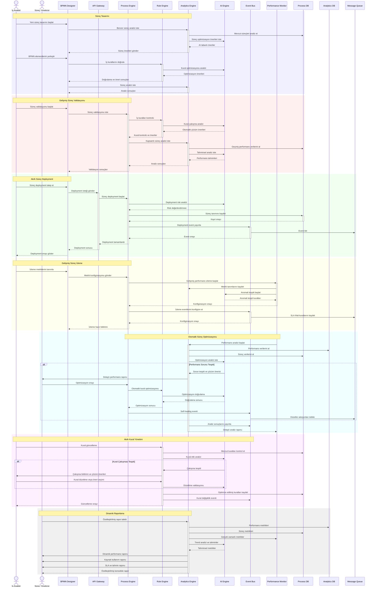

# BPM Platform - Süreç Yönetimi Sequence Diyagramı

Bu diyagram, BPM Platform'daki süreç yönetimi iş akışını ve bileşenler arası etkileşimleri gösterir.

## Diyagram Açıklaması

### Aktörler
- **İş Analisti**: Süreç tasarımı ve kural yönetiminden sorumlu
- **Süreç Yöneticisi**: Süreç performansı ve optimizasyonundan sorumlu

### Ana Bileşenler
- **BPMN Designer**: Süreç tasarım arayüzü
- **Process Engine**: Süreç yürütme motoru
- **Rule Engine**: İş kuralları motoru
- **Analytics Engine**: Analiz ve raporlama motoru
- **AI Engine**: Yapay zeka ve tahminsel analiz motoru
- **Event Bus**: Event-driven iletişim altyapısı

### İş Akışları

#### Süreç Tasarımı
1. Yeni süreç tasarımı başlatma
2. AI destekli benzer süreç analizi
3. BPMN elementlerinin yerleştirilmesi
4. Otomatik kural optimizasyonu

#### Süreç Validasyonu
1. Validasyon başlatma
2. AI destekli kural kontrolü
3. Tahminsel performans analizi
4. Kapsamlı sonuç değerlendirmesi

#### Süreç Deployment
1. Risk analizi ile deployment talebi
2. Süreç tanımı kaydetme
3. Kapsamlı event yayınlama
4. Güvenli deployment onayı

#### Süreç İzleme
1. Gelişmiş metrik tanımlama
2. AI destekli anomali tespiti
3. SLA bazlı event konfigürasyonu
4. Proaktif izleme başlatma

#### Süreç Optimizasyonu
1. AI destekli performans analizi
2. Otomatik sorun tespiti
3. Self-healing optimizasyonu
4. Kapsamlı sonuç raporlama

#### İş Kuralları Yönetimi
1. AI destekli kural güncelleme
2. Otomatik çakışma tespiti
3. Çözüm önerileri sunma
4. Optimize edilmiş kural kaydetme

#### Raporlama
1. Özelleştirilmiş rapor talebi
2. Çok boyutlu metrik toplama
3. Tahminsel analiz
4. Dinamik rapor oluşturma 