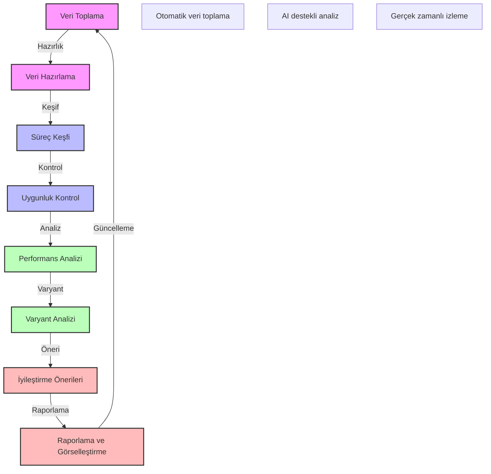

# BPM Platform - Süreç Madenciliği Detay Akışı

Bu diyagram, BPM platformunun süreç madenciliği detay akışını ve analiz süreçlerini göstermektedir.

## Önemli Noktalar

1. Veri Toplama
   - Olay günlükleri
   - Süreç verileri
   - Sistem metrikleri
   - Kullanıcı aktiviteleri

2. Veri Hazırlama
   - Veri temizleme
   - Veri dönüşümü
   - Veri zenginleştirme
   - Veri doğrulama

3. Süreç Keşfi
   - Süreç modeli çıkarma
   - Akış analizi
   - İlişki keşfi
   - Örüntü tanıma

4. Uygunluk Kontrol
   - Model karşılaştırma
   - Sapma analizi
   - Kural kontrolü
   - Uyumluluk denetimi

5. Performans Analizi
   - Süreç metrikleri
   - Darboğaz analizi
   - Kaynak kullanımı
   - Zaman analizi

6. Varyant Analizi
   - Varyant keşfi
   - Varyant karşılaştırma
   - Varyant etkisi
   - Varyant optimizasyonu

7. İyileştirme Önerileri
   - Süreç optimizasyonu
   - Kaynak optimizasyonu
   - Maliyet azaltma
   - Verimlilik artırma

8. Raporlama ve Görselleştirme
   - Süreç haritaları
   - Performans göstergeleri
   - Trend analizleri
   - İnteraktif dashboardlar 