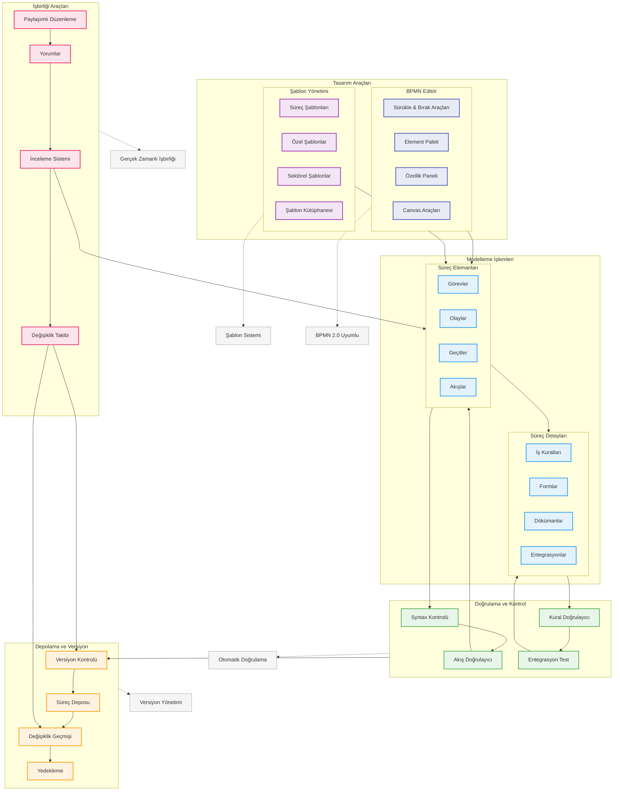

# BPM Platform - Süreç Modelleme Akışı

Bu diyagram, BPM Platform'da iş süreçlerinin modellenmesi ve tasarımı sürecini gösterir.

## Diyagram Açıklaması

### Tasarım Araçları
#### BPMN Editör
- **Sürükle & Bırak**: Kolay süreç tasarımı
- **Element Paleti**: BPMN elementleri
- **Özellik Paneli**: Element özellikleri
- **Canvas Araçları**: Düzenleme araçları

#### Şablon Yönetimi
- **Süreç Şablonları**: Hazır şablonlar
- **Özel Şablonlar**: Kullanıcı şablonları
- **Sektörel Şablonlar**: Endüstri şablonları
- **Şablon Kütüphanesi**: Merkezi depo

### Modelleme İşlemleri
#### Süreç Elemanları
- **Görevler**: İş adımları
- **Olaylar**: Tetikleyiciler
- **Geçitler**: Karar noktaları
- **Akışlar**: Süreç akışları

#### Süreç Detayları
- **İş Kuralları**: Karar mantığı
- **Formlar**: Veri girişi
- **Dökümanlar**: İlgili belgeler
- **Entegrasyonlar**: Sistem bağlantıları

### Doğrulama ve Kontrol
- **Syntax Kontrolü**: BPMN kuralları
- **Kural Doğrulayıcı**: İş mantığı
- **Akış Doğrulayıcı**: Süreç akışı
- **Entegrasyon Test**: Bağlantı testleri

### Depolama ve Versiyon
- **Versiyon Kontrolü**: Sürüm yönetimi
- **Süreç Deposu**: Merkezi depolama
- **Değişiklik Geçmişi**: Audit trail
- **Yedekleme**: Veri güvenliği

### İşbirliği Araçları
- **Yorumlar**: Geri bildirim
- **Paylaşımlı Düzenleme**: Eş zamanlı çalışma
- **İnceleme Sistemi**: Kalite kontrol
- **Değişiklik Takibi**: Revizyon takibi

### Önemli Özellikler
- Gerçek zamanlı işbirliği
- Otomatik doğrulama
- Versiyon yönetimi
- Şablon sistemi
- BPMN 2.0 uyumluluğu
