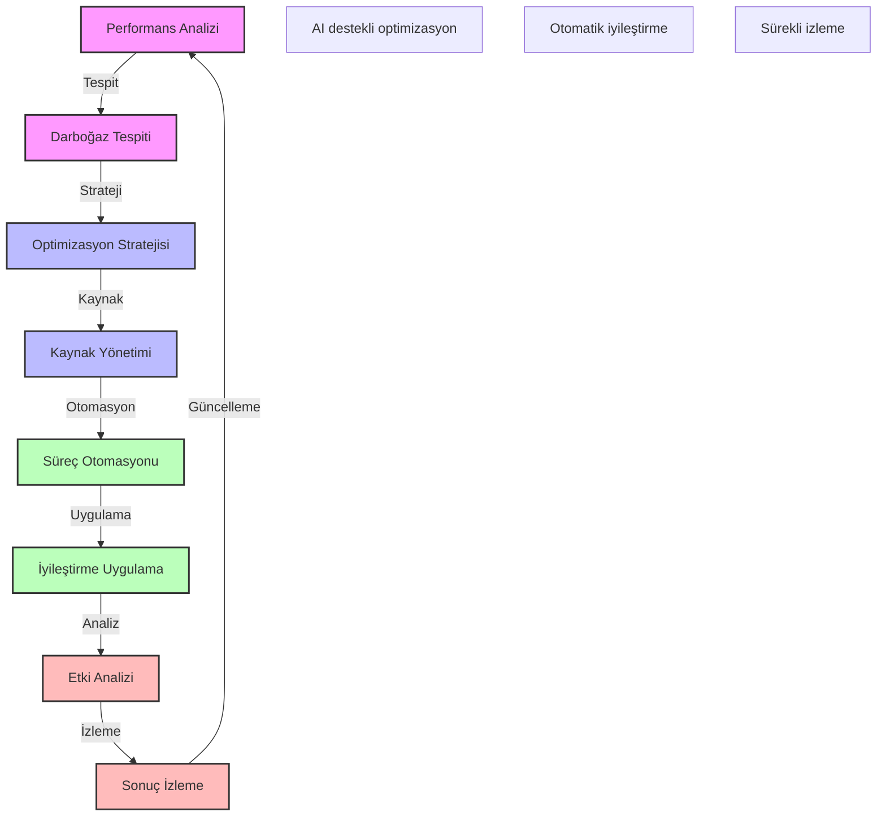

# BPM Platform - Süreç Optimizasyon Stratejileri

Bu diyagram, BPM platformunun süreç optimizasyon stratejilerini ve iyileştirme yaklaşımlarını göstermektedir.

## Önemli Noktalar

1. Performans Analizi
   - Süreç metrikleri
   - KPI takibi
   - Trend analizi
   - Benchmark karşılaştırma

2. Darboğaz Tespiti
   - Kaynak analizi
   - Zaman analizi
   - Maliyet analizi
   - Kalite analizi

3. Optimizasyon Stratejisi
   - Hedef belirleme
   - Önceliklendirme
   - Risk değerlendirme
   - Yol haritası

4. Kaynak Yönetimi
   - Kaynak planlama
   - Kapasite optimizasyonu
   - İş yükü dengeleme
   - Maliyet optimizasyonu

5. Süreç Otomasyonu
   - RPA entegrasyonu
   - AI/ML kullanımı
   - İş kuralları otomasyonu
   - Karar otomasyonu

6. İyileştirme Uygulama
   - Değişiklik yönetimi
   - Test ve doğrulama
   - Aşamalı geçiş
   - Geri bildirim toplama

7. Etki Analizi
   - Performans etkisi
   - Maliyet etkisi
   - Kullanıcı etkisi
   - İş etkisi

8. Sonuç İzleme
   - Metrik takibi
   - Hedef karşılaştırma
   - ROI analizi
   - Sürekli iyileştirme 