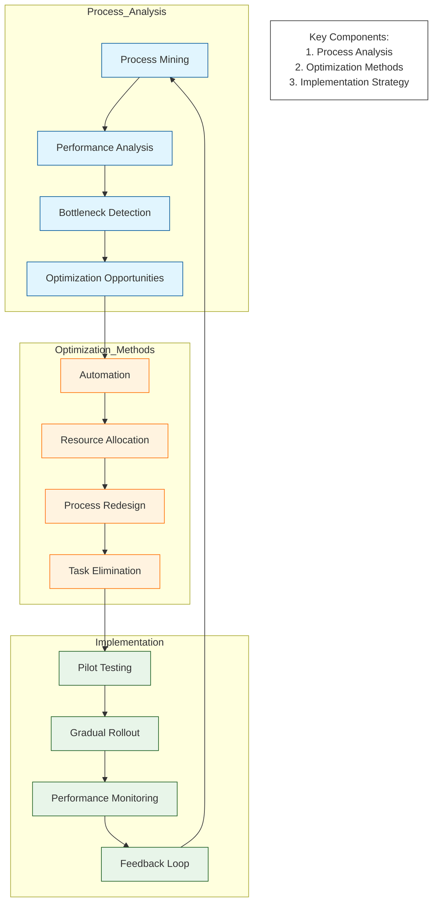

# Process Optimization Strategy

## Strategy Components

1. Process Analysis
   - Process Mining and Discovery
   - Performance Metrics Analysis
   - Bottleneck Identification
   - Opportunity Assessment

2. Optimization Methods
   - Automation Opportunities
   - Resource Allocation Optimization
   - Process Redesign
   - Task Elimination/Consolidation

3. Implementation Approach
   - Pilot Testing
   - Gradual Rollout Strategy
   - Continuous Monitoring
   - Feedback Integration

## Success Metrics

- Process Cycle Time
- Resource Utilization
- Error Rates
- Cost Reduction
- Customer Satisfaction