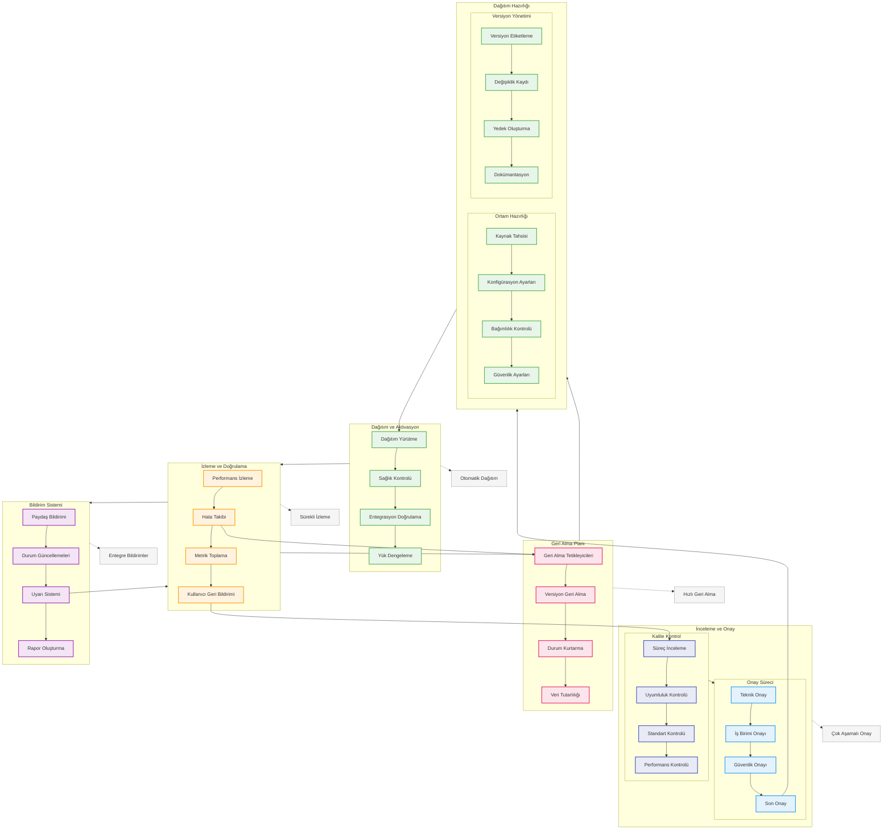

# BPM Platform - Süreç Yayınlama Akışı

Bu diyagram, BPM Platform'da modellenmiş süreçlerin yayınlama ve dağıtım sürecini gösterir.

## Diyagram Açıklaması

### İnceleme ve Onay
#### Kalite Kontrol
- **Süreç İnceleme**: Süreç tasarımı kontrolü
- **Uyumluluk Kontrolü**: Standartlara uygunluk
- **Standart Kontrolü**: BPMN standartları
- **Performans Kontrolü**: Performans metrikleri

#### Onay Süreci
- **Teknik Onay**: Teknik ekip onayı
- **İş Birimi Onayı**: İş sahipleri onayı
- **Güvenlik Onayı**: Güvenlik ekibi onayı
- **Son Onay**: Yönetim onayı

### Dağıtım Hazırlığı
#### Ortam Hazırlığı
- **Kaynak Tahsisi**: Sistem kaynakları
- **Konfigürasyon**: Sistem ayarları
- **Bağımlılık Kontrolü**: Sistem bağımlılıkları
- **Güvenlik Ayarları**: Güvenlik konfigürasyonu

#### Versiyon Yönetimi
- **Versiyon Etiketleme**: Sürüm numaraları
- **Değişiklik Kaydı**: Changelog
- **Yedek Oluşturma**: Backup
- **Dokümantasyon**: Teknik dökümanlar

### Dağıtım ve Aktivasyon
- **Dağıtım Yürütme**: Deployment
- **Sağlık Kontrolü**: Health check
- **Entegrasyon Doğrulama**: Integration tests
- **Yük Dengeleme**: Load balancing

### İzleme ve Doğrulama
- **Performans İzleme**: Performans metrikleri
- **Hata Takibi**: Error tracking
- **Metrik Toplama**: Metrics collection
- **Kullanıcı Geri Bildirimi**: User feedback

### Geri Alma Planı
- **Geri Alma Tetikleyicileri**: Rollback triggers
- **Versiyon Geri Alma**: Version rollback
- **Durum Kurtarma**: State recovery
- **Veri Tutarlılığı**: Data consistency

### Bildirim Sistemi
- **Paydaş Bildirimi**: Stakeholder notifications
- **Durum Güncellemeleri**: Status updates
- **Uyarı Sistemi**: Alert system
- **Rapor Oluşturma**: Report generation

### Önemli Özellikler
- Otomatik dağıtım
- Sürekli izleme
- Hızlı geri alma
- Entegre bildirimler
- Çok aşamalı onay
