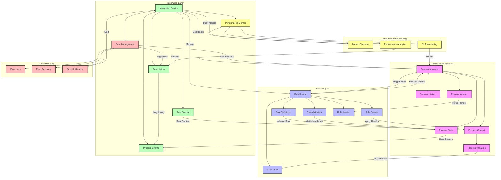

# Process Rules Integration Flow

Bu diyagram, süreç yönetimi ve kural motoru arasındaki detaylı entegrasyonu gösterir.



## Detaylı Açıklama

### Ana Bileşenler

1. **Process Management**
   - Process Instance (P): Çalışan süreç örneği (örn. müşteri siparişi)
   - Process Context (PC): Süreç bağlamı ve gerekli bilgiler
   - Process Variables (PV): Süreçte kullanılan dinamik veriler
   - Process State (PS): Sürecin mevcut durumu
   - Process History (PH): Süreç geçmişi
   - Process Version (PVer): Süreç versiyonu

2. **Rules Engine**
   - Rule Engine (RE): Kuralların işlendiği ana motor
   - Rule Definitions (RD): Tanımlı kurallar deposu
   - Rule Facts (RF): Kural değerlendirme verileri
   - Rule Results (RR): Kural çalıştırma sonuçları
   - Rule Validation (RV): Kural doğrulama mekanizması
   - Rule Version (RVer): Kural versiyonlama

3. **Integration Layer**
   - Integration Service (IL): Entegrasyon yönetimi
   - Rule Context (RC): Kural bağlamı senkronizasyonu
   - Process Events (PE): Süreç olayları yönetimi
   - Rule History (RH): Kural çalıştırma geçmişi
   - Error Management (EM): Hata yönetimi
   - Performance Monitor (PM): Performans izleme

### Özel Bileşenler

1. **Error Handling**
   - Error Logs (EL): Hata kayıtları
   - Error Recovery (ER): Hata kurtarma mekanizmaları
   - Error Notification (EN): Hata bildirimleri

2. **Performance Monitoring**
   - Metrics Tracking (MT): Metrik takibi
   - Performance Analytics (PA): Performans analizi
   - SLA Monitoring (SLA): SLA takibi

### Kritik Akışlar

1. **Versiyon Kontrolü**
   - Süreç versiyonu ile kural versiyonu uyumluluğu kontrolü
   - Versiyon değişikliklerinde otomatik güncelleme

2. **Hata Yönetimi**
   - Hataların yakalanması ve loglanması
   - Otomatik kurtarma mekanizmaları
   - İlgili taraflara bildirim

3. **Performans İzleme**
   - Kural çalıştırma süreleri
   - Başarı/başarısızlık oranları
   - SLA uygunluk takibi

4. **Entegrasyon Yönetimi**
   - Bağlam senkronizasyonu
   - Olay yönetimi
   - Durum takibi

### Kullanım Örnekleri

1. **Sipariş Süreci Örneği**
   ```json
   {
     "processInstance": "OrderProcess_123",
     "context": {
       "orderId": "ORD-123",
       "amount": 1500,
       "customer": "ABC Corp"
     },
     "rules": [
       {
         "name": "DiscountRule",
         "condition": "amount > 1000",
         "action": "applyDiscount(10)"
       }
     ]
   }
   ```

2. **Hata Yönetimi Örneği**
   ```json
   {
     "error": {
       "type": "RuleValidationError",
       "message": "Invalid rule condition",
       "recovery": "UseDefaultRule",
       "notification": {
         "level": "WARNING",
         "recipients": ["process-admin"]
       }
     }
   }
   ```

3. **Performans Metriği Örneği**
   ```json
   {
     "metrics": {
       "ruleExecutionTime": "150ms",
       "successRate": "99.5%",
       "activeProcesses": 250,
       "slaCompliance": "98%"
     }
   }
   ```
``` 