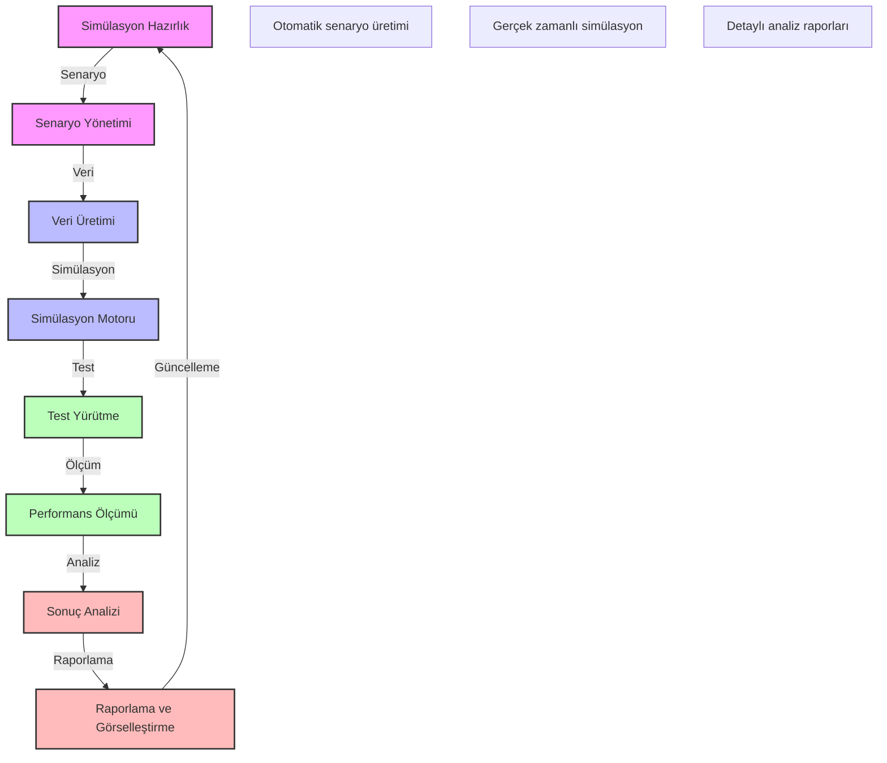

# BPM Platform - Süreç Simülasyon ve Test Akışı

Bu diyagram, BPM platformunun süreç simülasyon ve test akışını göstermektedir.

## Önemli Noktalar

1. Simülasyon Hazırlık
   - Süreç modeli hazırlama
   - Parametre tanımlama
   - Kaynak planlama
   - Kısıt belirleme

2. Senaryo Yönetimi
   - Senaryo oluşturma
   - Senaryo varyasyonları
   - Koşul tanımlama
   - Senaryo doğrulama

3. Veri Üretimi
   - Test verisi üretimi
   - Veri çeşitlendirme
   - Veri doğrulama
   - Veri zenginleştirme

4. Simülasyon Motoru
   - Süreç yürütme
   - Olay işleme
   - Durum yönetimi
   - Zamanlama kontrolü

5. Test Yürütme
   - Birim testler
   - Entegrasyon testleri
   - Yük testleri
   - Performans testleri

6. Performans Ölçümü
   - Yanıt süreleri
   - Kaynak kullanımı
   - İş yükü analizi
   - Darboğaz tespiti

7. Sonuç Analizi
   - Performans analizi
   - Karşılaştırmalı analiz
   - İstatistiksel analiz
   - Tahminsel analiz

8. Raporlama ve Görselleştirme
   - Performans raporları
   - Karşılaştırma grafikleri
   - Trend analizleri
   - İnteraktif dashboardlar 