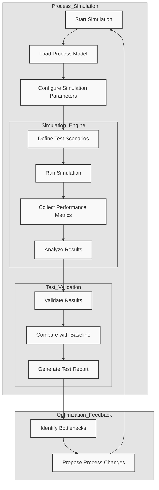

# Process Simulation and Test Flow

## Diagram Components

1. Process Simulation
   - Initial setup and configuration
   - Model loading and parameter setup
   - Scenario definition

2. Simulation Engine
   - Core simulation execution
   - Metrics collection
   - Results analysis

3. Test Validation
   - Results validation
   - Baseline comparison
   - Report generation

4. Optimization Feedback
   - Bottleneck identification
   - Change proposals
   - Continuous improvement loop

## Usage Notes

- Use this diagram to understand the complete simulation and testing workflow
- Follow the feedback loop for continuous process improvement
- Ensure all metrics are properly configured before simulation