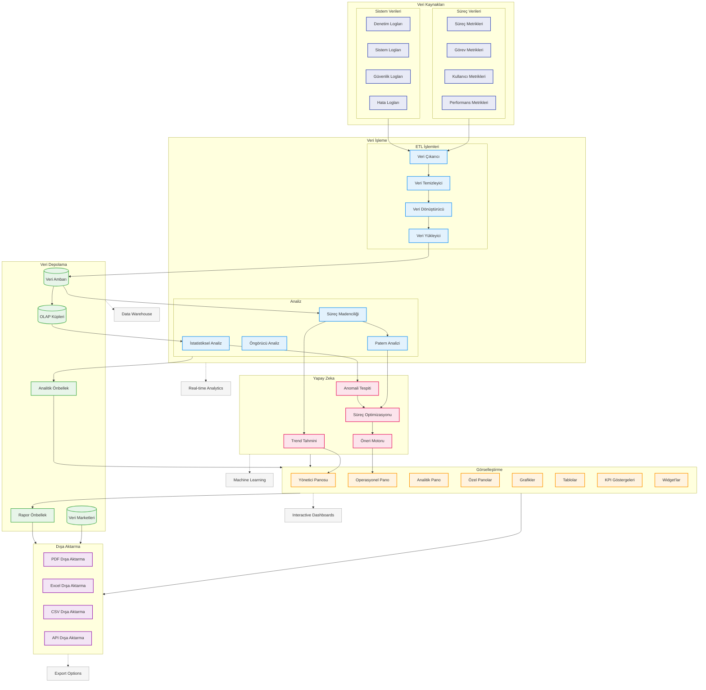

# BPM Platform - Raporlama ve Analitik Akışı

Bu diyagram, BPM Platform'un raporlama ve analitik süreçlerini gösterir.



## Diyagram Açıklaması

### Veri Kaynakları
#### Süreç Verileri
- **Süreç Metrikleri**: BPMN süreç performansı
- **Görev Metrikleri**: Task istatistikleri
- **Kullanıcı Metrikleri**: Kullanıcı aktiviteleri
- **Performans Metrikleri**: Sistem performansı

#### Sistem Verileri
- **Denetim Logları**: Audit trail
- **Sistem Logları**: Sistem olayları
- **Güvenlik Logları**: Güvenlik olayları
- **Hata Logları**: Error logging

### Veri İşleme
#### ETL İşlemleri
- **Veri Çıkarıcı**: Data extraction
- **Veri Dönüştürücü**: Data transformation
- **Veri Yükleyici**: Data loading
- **Veri Temizleyici**: Data cleaning

#### Analiz
- **İstatistiksel Analiz**: Statistical analysis
- **Öngörücü Analiz**: Predictive analysis
- **Süreç Madenciliği**: Process mining
- **Patern Analizi**: Pattern recognition

### Veri Depolama
- **Veri Ambarı**: Data warehouse
- **Veri Marketleri**: Data marts
- **OLAP Küpleri**: OLAP cubes
- **Önbellek**: Analytics/Report cache

### Görselleştirme
- **Yönetici Panosu**: Executive insights
- **Operasyonel Pano**: Operational metrics
- **Analitik Pano**: Analytical insights
- **Özel Panolar**: Custom dashboards

### Yapay Zeka
- **Trend Tahmini**: Trend prediction
- **Anomali Tespiti**: Anomaly detection
- **Süreç Optimizasyonu**: Process optimization
- **Öneri Motoru**: Recommendation engine

### Dışa Aktarma
- **PDF**: PDF export
- **Excel**: Excel export
- **CSV**: CSV export
- **API**: API integration

### Önemli Özellikler
- Gerçek zamanlı analitik
- Makine öğrenimi
- Veri ambarı
- İnteraktif panolar
- Dışa aktarma seçenekleri
``` 