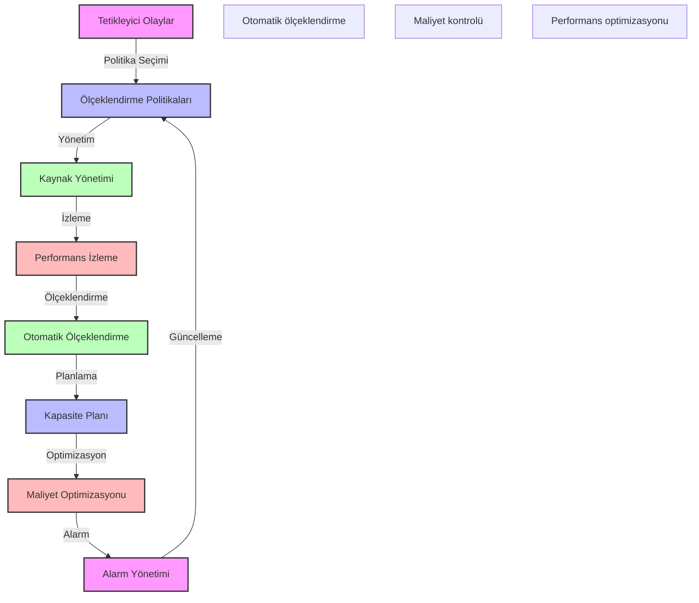

# BPM Platform - Ölçeklendirme Politikaları

Bu diyagram, BPM platformunun ölçeklendirme politikalarını göstermektedir.

## Önemli Noktalar

1. Tetikleyici Olaylar
   - CPU kullanımı
   - Bellek kullanımı
   - İstek sayısı
   - Yanıt süresi

2. Ölçeklendirme Politikaları
   - Yatay ölçeklendirme
   - Dikey ölçeklendirme
   - Otomatik ölçeklendirme
   - Manuel ölçeklendirme

3. Kaynak Yönetimi
   - Kaynak havuzu
   - Kaynak tahsisi
   - Kaynak geri alma
   - Kaynak optimizasyonu

4. Performans Kriterleri
   - SLA hedefleri
   - Kapasite eşikleri
   - Performans metrikleri
   - Kullanım trendleri

5. Maliyet Yönetimi
   - Bütçe kontrolü
   - Kaynak maliyetleri
   - Optimizasyon önerileri
   - ROI analizi