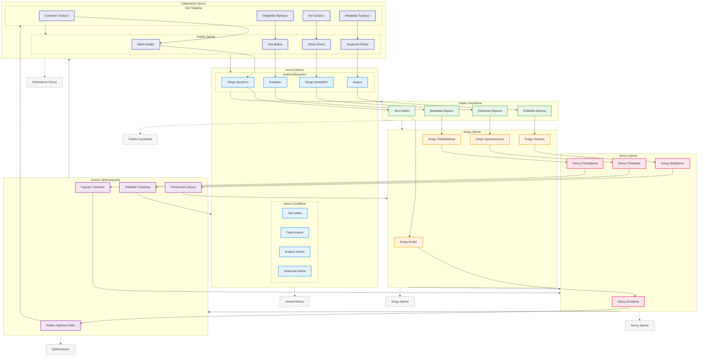

# BPM Platform - Arama ve İndeksleme Akışı

Bu diyagram, BPM Platform'un arama ve indeksleme süreçlerini gösterir.

## Diyagram Açıklaması

### İndeksleme Süreci
#### Veri Toplama
- **Doküman Tarayıcı**: Document crawler
- **Veri Çıkarıcı**: Data extractor
- **Metadata Toplayıcı**: Metadata collector
- **Değişiklik Algılayıcı**: Change detector

#### İndeks İşleme
- **Metin Analizi**: Text analysis
- **Token Üretici**: Token generator
- **Stopword Filtresi**: Stopword filter
- **Kök Bulma**: Stemming

### Arama Motoru
#### Arama Bileşenleri
- **Sorgu Ayrıştırıcı**: Query parser
- **Sorgu Genişletici**: Query expander
- **Arayıcı**: Searcher
- **Sıralayıcı**: Ranker

#### Arama Özellikleri
- **Tam Metin**: Full text
- **Faset Arama**: Faceted search
- **Bulanık Arama**: Fuzzy search
- **Anlamsal Arama**: Semantic search

### İndeks Depolama
- **Ters İndeks**: Inverted index
- **Doküman Deposu**: Document store
- **Önbellek Deposu**: Cache store
- **Metadata Deposu**: Metadata store

### Sorgu İşleme
- **Sorgu Analizi**: Query analysis
- **Sorgu Optimizasyonu**: Query optimization
- **Sorgu Yürütme**: Query execution
- **Sorgu Önbellekleme**: Query caching

### Sonuç İşleme
- **Sonuç Sıralama**: Result ranking
- **Sonuç Filtreleme**: Result filtering
- **Sonuç Birleştirme**: Result aggregation
- **Sonuç Formatlama**: Result formatting

### Arama Optimizasyonu
- **İndeks Optimize Edici**: Index optimizer
- **Önbellek Yöneticisi**: Cache manager
- **Performans İzleyici**: Performance monitor
- **Kaynak Yöneticisi**: Resource manager

### Önemli Özellikler
- İndeksleme süreci
- Arama motoru
- İndeks depolama
- Sorgu işleme
- Sonuç işleme
- Arama optimizasyonu 