# BPM Platform - Güvenlik ve Kimlik Doğrulama Akışı

Bu diyagram, BPM Platform'un güvenlik, kimlik doğrulama ve yetkilendirme süreçlerini gösterir.

```mermaid
graph TB
    %% Stil Tanımlamaları
    classDef auth fill:#E8EAF6,stroke:#3F51B5,stroke-width:2px
    classDef validation fill:#E3F2FD,stroke:#2196F3,stroke-width:2px
    classDef security fill:#E8F5E9,stroke:#4CAF50,stroke-width:2px
    classDef session fill:#FFF3E0,stroke:#FF9800,stroke-width:2px
    classDef error fill:#FCE4EC,stroke:#E91E63,stroke-width:2px
    classDef monitoring fill:#F3E5F5,stroke:#9C27B0,stroke-width:2px

    %% Kimlik Doğrulama
    subgraph Authentication["Kimlik Doğrulama"]
        %% Doğrulama Yöntemleri
        subgraph AuthMethods["Doğrulama Yöntemleri"]
            LocalLogin[Yerel Giriş]:::auth
            OAuth[OAuth/OAuth2]:::auth
            LDAP[LDAP/Active Directory]:::auth
            Certificate[Sertifika]:::auth
        end

        %% MFA
        subgraph MFASystem["Çok Faktörlü Doğrulama"]
            SMS[SMS Kodu]:::auth
            Email[E-posta Kodu]:::auth
            Authenticator[Authenticator]:::auth
            Biometric[Biyometrik]:::auth
        end
    end

    %% Güvenlik Kontrolleri
    subgraph SecurityControls["Güvenlik Kontrolleri"]
        %% Kontrol Mekanizmaları
        subgraph SecurityMechanisms["Güvenlik Mekanizmaları"]
            PasswordPolicy[Şifre Politikası]:::security
            BruteForce[Brute Force Koruması]:::security
            IPBlocking[IP Engelleme]:::security
            RateLimit[İstek Sınırlama]:::security
        end

        %% Güvenlik Özellikleri
        subgraph SecurityFeatures["Güvenlik Özellikleri"]
            Encryption[Şifreleme]:::security
            HTTPS[HTTPS/TLS]:::security
            CORS[CORS Politikası]:::security
            XSS[XSS Koruması]:::security
        end
    end

    %% Oturum Yönetimi
    subgraph SessionManagement["Oturum Yönetimi"]
        %% Oturum İşlemleri
        TokenGeneration[Token Üretimi]:::session
        TokenValidation[Token Doğrulama]:::session
        SessionTimeout[Oturum Zaman Aşımı]:::session
        SessionInvalidation[Oturum İptali]:::session
    end

    %% Yetkilendirme
    subgraph Authorization["Yetkilendirme"]
        %% Yetki Kontrolleri
        RoleManagement[Rol Yönetimi]:::validation
        PermissionCheck[İzin Kontrolü]:::validation
        AccessControl[Erişim Kontrolü]:::validation
        PolicyEnforcement[Politika Uygulama]:::validation
    end

    %% Hata Yönetimi
    subgraph ErrorHandling["Hata Yönetimi"]
        %% Hata İşlemleri
        AuthErrors[Doğrulama Hataları]:::error
        ValidationErrors[Doğrulama Hataları]:::error
        SecurityErrors[Güvenlik Hataları]:::error
        SystemErrors[Sistem Hataları]:::error
    end

    %% İzleme ve Loglama
    subgraph MonitoringLogging["İzleme ve Loglama"]
        %% İzleme İşlemleri
        SecurityLogs[Güvenlik Logları]:::monitoring
        AuditLogs[Denetim Logları]:::monitoring
        AccessLogs[Erişim Logları]:::monitoring
        ErrorLogs[Hata Logları]:::monitoring
    end

    %% Bağlantılar - Kimlik Doğrulama
    AuthMethods --> MFASystem
    LocalLogin --> SMS
    OAuth --> Email
    LDAP --> Authenticator
    Certificate --> Biometric

    %% Bağlantılar - Güvenlik
    MFASystem --> SecurityControls
    SMS --> PasswordPolicy
    Email --> BruteForce
    Authenticator --> IPBlocking
    Biometric --> RateLimit

    %% Bağlantılar - Oturum
    SecurityControls --> SessionManagement
    PasswordPolicy --> TokenGeneration
    BruteForce --> TokenValidation
    IPBlocking --> SessionTimeout
    RateLimit --> SessionInvalidation

    %% Bağlantılar - Yetkilendirme
    SessionManagement --> Authorization
    TokenGeneration --> RoleManagement
    TokenValidation --> PermissionCheck
    SessionTimeout --> AccessControl
    SessionInvalidation --> PolicyEnforcement

    %% Bağlantılar - Hata
    Authorization --> ErrorHandling
    RoleManagement --> AuthErrors
    PermissionCheck --> ValidationErrors
    AccessControl --> SecurityErrors
    PolicyEnforcement --> SystemErrors

    %% Bağlantılar - İzleme
    ErrorHandling --> MonitoringLogging
    AuthErrors --> SecurityLogs
    ValidationErrors --> AuditLogs
    SecurityErrors --> AccessLogs
    SystemErrors --> ErrorLogs

    %% Geri Bildirim Döngüleri
    MonitoringLogging --> Authentication
    SecurityLogs --> SecurityControls
    AuditLogs --> SessionManagement
    AccessLogs --> Authorization

    %% Notlar
    note1[Kimlik Doğrulama]:::note
    note2[Güvenlik Kontrolleri]:::note
    note3[Oturum Yönetimi]:::note
    note4[Yetkilendirme]:::note
    note5[Hata Yönetimi]:::note
    note6[İzleme ve Loglama]:::note

    %% Not Bağlantıları
    Authentication -.-> note1
    SecurityControls -.-> note2
    SessionManagement -.-> note3
    Authorization -.-> note4
    ErrorHandling -.-> note5
    MonitoringLogging -.-> note6

    classDef note fill:#F5F5F5,stroke:#9E9E9E,stroke-width:1px
```

## Diyagram Açıklaması

### Kimlik Doğrulama
#### Doğrulama Yöntemleri
- **Yerel Giriş**: Username/password
- **OAuth/OAuth2**: Social login
- **LDAP/Active Directory**: Enterprise login
- **Sertifika**: Certificate-based

#### Çok Faktörlü Doğrulama
- **SMS Kodu**: SMS verification
- **E-posta Kodu**: Email verification
- **Authenticator**: TOTP/HOTP
- **Biyometrik**: Biometric auth

### Güvenlik Kontrolleri
#### Güvenlik Mekanizmaları
- **Şifre Politikası**: Password policy
- **Brute Force Koruması**: Brute force protection
- **IP Engelleme**: IP blocking
- **İstek Sınırlama**: Rate limiting

#### Güvenlik Özellikleri
- **Şifreleme**: Encryption
- **HTTPS/TLS**: Secure transport
- **CORS Politikası**: CORS policy
- **XSS Koruması**: XSS protection

### Oturum Yönetimi
- **Token Üretimi**: Token generation
- **Token Doğrulama**: Token validation
- **Oturum Zaman Aşımı**: Session timeout
- **Oturum İptali**: Session invalidation

### Yetkilendirme
- **Rol Yönetimi**: Role management
- **İzin Kontrolü**: Permission check
- **Erişim Kontrolü**: Access control
- **Politika Uygulama**: Policy enforcement

### Hata Yönetimi
- **Doğrulama Hataları**: Auth errors
- **Doğrulama Hataları**: Validation errors
- **Güvenlik Hataları**: Security errors
- **Sistem Hataları**: System errors

### İzleme ve Loglama
- **Güvenlik Logları**: Security logs
- **Denetim Logları**: Audit logs
- **Erişim Logları**: Access logs
- **Hata Logları**: Error logs

### Önemli Özellikler
- Kimlik doğrulama
- Güvenlik kontrolleri
- Oturum yönetimi
- Yetkilendirme
- Hata yönetimi
- İzleme ve loglama 