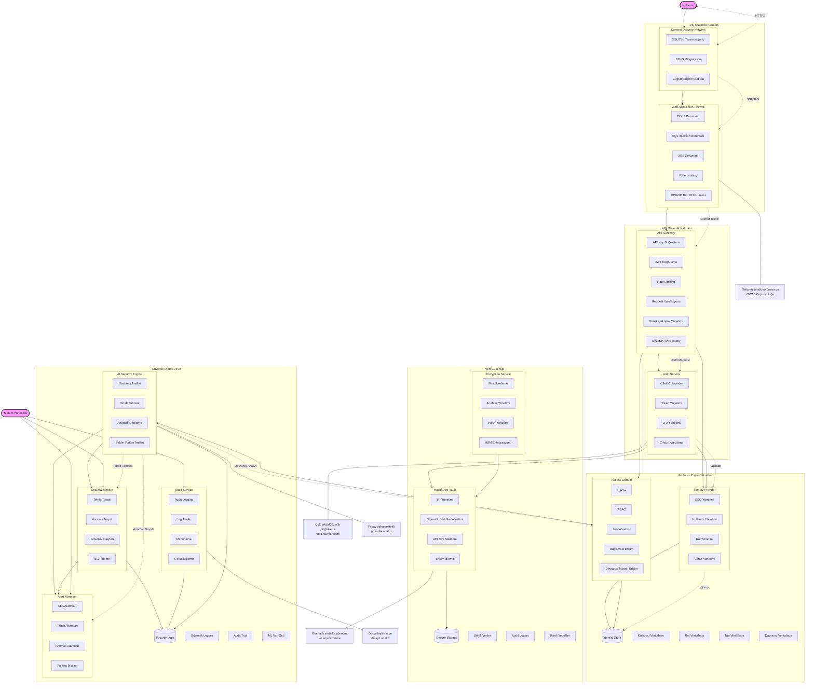

# BPM Platform - Gelişmiş Güvenlik Mimarisi

Bu diyagram, BPM Platform'un geliştirilmiş güvenlik mimarisini ve bileşenler arası güvenlik ilişkilerini gösterir.

## Diyagram Açıklaması

### Aktörler
- **Kullanıcı**: Sistem kullanıcıları
- **Sistem Yöneticisi**: Güvenlik yönetimi ve izlemeden sorumlu admin

### Güvenlik Katmanları

#### Dış Güvenlik Katmanı
- **WAF**: Gelişmiş web uygulama güvenlik duvarı
  - DDoS koruması
  - SQL Injection koruması
  - XSS koruması
  - Rate limiting
  - OWASP Top 10 koruması
- **CDN**: Gelişmiş içerik dağıtım ağı
  - SSL/TLS terminasyonu
  - DDoS mitigasyonu
  - Coğrafi erişim kontrolü

#### API Güvenlik Katmanı
- **API Gateway**: Gelişmiş API güvenlik kontrolü
  - API Key doğrulama
  - JWT doğrulama
  - Rate limiting
  - Request validasyonu
  - Kimlik çakışma yönetimi
  - OWASP API Security uyumluluğu
- **Auth Service**: Gelişmiş kimlik doğrulama servisi
  - OAuth2 provider
  - Token yönetimi
  - 2FA yönetimi
  - Cihaz doğrulama

#### Kimlik ve Erişim Yönetimi
- **Identity Provider**: Gelişmiş kimlik sağlayıcı
  - SSO yönetimi
  - Kullanıcı yönetimi
  - Rol yönetimi
  - Cihaz yönetimi
- **Access Control**: Gelişmiş erişim kontrolü
  - RBAC (Role-Based Access Control)
  - ABAC (Attribute-Based Access Control)
  - İzin yönetimi
  - Bağlamsal erişim
  - Davranış tabanlı erişim

#### Veri Güvenliği
- **Encryption Service**: Gelişmiş şifreleme servisi
  - Veri şifreleme
  - Anahtar yönetimi
  - Hash yönetimi
  - HSM entegrasyonu
- **Vault**: Gelişmiş güvenli veri depolama
  - Sır yönetimi
  - Otomatik sertifika yönetimi
  - API Key saklama
  - Erişim izleme

#### Güvenlik İzleme ve AI
- **Security Monitor**: Gelişmiş güvenlik izleme
  - Tehdit tespiti
  - Anomali tespiti
  - Güvenlik olayları
  - SLA izleme
- **AI Security Engine**: Yapay zeka güvenlik motoru
  - Davranış analizi
  - Tehdit tahmini
  - Anomali öğrenme
  - Saldırı patern analizi
- **Audit Service**: Gelişmiş denetim servisi
  - Audit logging
  - Log analizi
  - Raporlama
  - Görselleştirme
- **Alert Manager**: Alarm yönetimi
  - SLA alarmları
  - Tehdit alarmları
  - Anomali alarmları
  - Politika ihlalleri

### Güvenlik Akışları
1. Kullanıcı HTTPS üzerinden CDN'e bağlanır
2. CDN SSL/TLS terminasyonu yapar
3. WAF OWASP uyumlu filtreleme yapar
4. API Gateway kimlik doğrulama ve çakışma kontrolü yapar
5. Auth Service çok faktörlü yetkilendirme kontrolü yapar
6. AI Engine davranış analizi ve tehdit tahmini yapar
7. Tüm işlemler görselleştirmeli güvenlik loglarına kaydedilir 