# BPM Platform - Sequence Diagram

Bu diyagram, BPM Platform'daki temel süreçlerin akışını ve bileşenler arası etkileşimleri gösterir.

```mermaid
sequenceDiagram
    %% Aktörler ve Sistemler
    actor Kullanıcı
    participant Web UI
    participant API Gateway
    participant Cache
    participant Auth Service
    participant Process Engine
    participant Form Engine
    participant Rule Engine
    participant Integration Service
    participant Analytics Engine
    participant Process DB
    participant Document DB
    participant Event Bus
    participant Performance Monitor
    participant SLA Monitor

    %% Süreç Başlatma Senaryosu
    rect rgb(200, 220, 240)
        Note over Kullanıcı,Event Bus: Süreç Başlatma (Performans Optimizasyonlu)
        Kullanıcı->>+Web UI: Süreç Başlat
        Web UI->>+API Gateway: POST /api/processes
        
        API Gateway->>Cache: Önbellek Kontrolü
        Cache-->>API Gateway: Önbellek Durumu
        
        API Gateway->>+Auth Service: RBAC/ABAC Yetki Kontrolü
        Auth Service-->>-API Gateway: Detaylı Yetki Onayı
        
        API Gateway->>+Process Engine: Süreç Oluştur
        Process Engine->>Performance Monitor: Performans Metriklerini Başlat
        
        Process Engine->>+Process DB: Süreç Kaydı Oluştur
        Process DB-->>-Process Engine: Süreç ID
        
        Process Engine->>+Form Engine: Form Verilerini Al
        Form Engine->>+Rule Engine: Form Validasyonu
        Rule Engine-->>-Form Engine: Validasyon Sonucu
        Form Engine->>+Document DB: Form Verilerini Kaydet
        Document DB-->>-Form Engine: Kayıt Onayı
        Form Engine-->>-Process Engine: Form Hazır
        
        Process Engine->>+Rule Engine: Başlangıç Kurallarını Değerlendir
        Rule Engine-->>-Process Engine: Kural Sonuçları
        
        Process Engine->>+Event Bus: Süreç Başlatma Olayı
        Event Bus->>Performance Monitor: Performans Metriklerini Kaydet
        Event Bus->>SLA Monitor: SLA İzlemeyi Başlat
        Event Bus-->>-Process Engine: Olay Yayınlandı
        
        Process Engine-->>-API Gateway: Süreç Başlatıldı
        API Gateway->>Cache: Sonucu Önbellekle
        API Gateway-->>-Web UI: Süreç Detayları
        Web UI-->>-Kullanıcı: Süreç Başlatıldı Bildirimi (i18n)
    end

    %% Görev Tamamlama Senaryosu
    rect rgb(220, 240, 200)
        Note over Kullanıcı,Event Bus: Görev Tamamlama (SLA İzlemeli)
        Kullanıcı->>+Web UI: Görevi Tamamla
        Web UI->>+API Gateway: PUT /api/tasks/{id}
        
        API Gateway->>+Auth Service: RBAC/ABAC Yetki Kontrolü
        Auth Service-->>-API Gateway: Detaylı Yetki Onayı
        
        API Gateway->>+Process Engine: Görev Güncelle
        Process Engine->>Performance Monitor: Görev Metriklerini Başlat
        
        Process Engine->>+Form Engine: Form Verilerini Doğrula
        Form Engine->>+Rule Engine: Detaylı Form Validasyonu
        Rule Engine-->>-Form Engine: Validasyon Sonucu ve Hata Mesajları
        Form Engine-->>-Process Engine: Doğrulama Sonucu
        
        Process Engine->>+Process DB: Görev Durumunu Güncelle
        Process DB-->>-Process Engine: Güncelleme Onayı
        
        Process Engine->>+Rule Engine: Sonraki Adım Kurallarını Değerlendir
        Rule Engine-->>-Process Engine: Sonraki Adım
        
        Process Engine->>+Event Bus: Görev Tamamlama Olayı
        Event Bus->>SLA Monitor: SLA Kontrolü
        SLA Monitor-->>Event Bus: SLA Durumu
        Event Bus->>Analytics Engine: Görev Metriklerini Analiz Et
        Event Bus-->>-Process Engine: Olay Yayınlandı
        
        Process Engine-->>-API Gateway: Görev Tamamlandı
        API Gateway->>Cache: Önbelleği Güncelle
        API Gateway-->>-Web UI: Güncelleme Sonucu
        Web UI-->>-Kullanıcı: Görev Tamamlandı Bildirimi (i18n)
    end

    %% Süreç İzleme Senaryosu
    rect rgb(240, 220, 200)
        Note over Kullanıcı,Event Bus: Süreç İzleme (Anomali Tespitli)
        Kullanıcı->>+Web UI: Süreç Durumunu Görüntüle
        Web UI->>+API Gateway: GET /api/processes/{id}
        
        API Gateway->>Cache: Önbellek Kontrolü
        Cache-->>API Gateway: Önbellek Durumu
        
        API Gateway->>+Auth Service: RBAC/ABAC Yetki Kontrolü
        Auth Service-->>-API Gateway: Detaylı Yetki Onayı
        
        API Gateway->>+Process Engine: Süreç Detaylarını Al
        Process Engine->>Performance Monitor: Performans Kontrolü
        Performance Monitor-->>Process Engine: Performans Metrikleri
        
        Process Engine->>+Process DB: Süreç Verilerini Sorgula
        Process DB-->>-Process Engine: Süreç Verileri
        
        Process Engine->>+Document DB: İlgili Dokümanları Al
        Document DB-->>-Process Engine: Doküman Listesi
        
        Process Engine->>+Integration Service: Harici Sistem Durumlarını Al
        Integration Service->>Integration Service: Timeout Kontrolü
        Integration Service->>Integration Service: Retry Mekanizması
        Integration Service-->>-Process Engine: Entegrasyon Durumları
        
        Process Engine->>Analytics Engine: Anomali Kontrolü
        Analytics Engine-->>Process Engine: Anomali Raporu
        
        Process Engine-->>-API Gateway: Süreç Detayları
        API Gateway->>Cache: Sonucu Önbellekle
        API Gateway-->>-Web UI: Süreç Bilgileri
        Web UI->>Web UI: BPMN Görselleştirme
        Web UI-->>-Kullanıcı: Süreç Durumu Gösterimi (i18n)
    end

    %% Süreç İptali Senaryosu
    rect rgb(240, 200, 220)
        Note over Kullanıcı,Event Bus: Süreç İptali (Rollback Destekli)
        Kullanıcı->>+Web UI: Süreci İptal Et
        Web UI->>+API Gateway: DELETE /api/processes/{id}
        
        API Gateway->>+Auth Service: RBAC/ABAC Yetki Kontrolü
        Auth Service-->>-API Gateway: Detaylı Yetki Onayı
        
        API Gateway->>+Process Engine: Süreç İptali
        Process Engine->>Process DB: Yedek Oluştur
        
        Process Engine->>+Rule Engine: İptal Kurallarını Kontrol Et
        Rule Engine-->>-Process Engine: İptal Onayı
        
        Process Engine->>+Process DB: Süreç Durumunu Güncelle
        Process DB-->>-Process Engine: Güncelleme Onayı
        
        Process Engine->>+Event Bus: Süreç İptal Olayı
        Event Bus->>SLA Monitor: SLA İzlemeyi Sonlandır
        Event Bus->>Analytics Engine: İptal Metriklerini Kaydet
        Event Bus-->>-Process Engine: Olay Yayınlandı
        
        Process Engine->>+Integration Service: İlgili Sistemleri Bilgilendir
        Integration Service->>Integration Service: Timeout Kontrolü
        Integration Service->>Integration Service: Retry Mekanizması
        Integration Service-->>-Process Engine: Bildirim Onayı
        
        alt İptal Başarısız
            Process Engine->>Process DB: Rollback Başlat
            Process DB-->>Process Engine: Rollback Tamamlandı
        end
        
        Process Engine-->>-API Gateway: Süreç İptal Edildi
        API Gateway->>Cache: Önbelleği Temizle
        API Gateway-->>-Web UI: İptal Onayı
        Web UI-->>-Kullanıcı: İptal Bildirimi (i18n)
    end
```



## Diyagram Açıklaması

### Yeni Eklenen Bileşenler
- **Cache**: API Gateway önbellekleme sistemi
- **Performance Monitor**: Performans metriklerini izleme sistemi
- **SLA Monitor**: SLA kurallarını ve ihlallerini izleme sistemi
- **Analytics Engine**: Anomali tespiti ve metrik analizi

### Geliştirilen Özellikler

#### 1. Performans Optimizasyonu
- API Gateway'de önbellekleme mekanizması
- Performance Monitor ile metrik takibi
- Yük dengeleme ve ölçeklendirme desteği

#### 2. Anomali Tespiti
- Analytics Engine ile süreç anomalilerinin tespiti
- Performance Monitor ile performans anomalilerinin izlenmesi
- Proaktif uyarı sistemi

#### 3. SLA Yönetimi
- SLA Monitor ile süreç sürelerinin takibi
- Gerçek zamanlı SLA ihlal bildirimleri
- SLA metriklerinin analizi

#### 4. Hata Yönetimi
- Detaylı form validasyonu ve hata mesajları
- Integration Service'de timeout ve retry mekanizması
- İptal senaryosunda rollback desteği

#### 5. Gelişmiş Güvenlik
- RBAC ve ABAC tabanlı yetkilendirme
- Detaylı audit logging
- Güvenli önbellekleme

#### 6. Kullanıcı Deneyimi
- i18n destekli bildirimler
- BPMN tabanlı süreç görselleştirme
- Detaylı hata mesajları ve yönlendirmeler
``` 