# SLA-Integration Flow

Bu diyagram, SLA yönetimi ve sistem entegrasyonlarını gösterir.

```mermaid
flowchart TD
    subgraph SLA Management
        SM[SLA Manager] --> SD[SLA Designer]
        SM --> SV[SLA Validator]
        SM --> ST[SLA Tracker]
        
        %% SLA Components
        SD --> SC[SLA Conditions]
        SD --> SR[SLA Rules]
        SD --> SP[SLA Policies]
        
        %% SLA Monitoring
        ST --> SL[SLA Levels]
        ST --> SI[SLA Indicators]
        ST --> SS[SLA Status]
        ST --> ML[ML Predictor]
    end

    subgraph Time Management
        TM[Time Manager] --> TC[Time Calculator]
        TM --> TT[Time Tracker]
        TM --> TP[Time Predictor]
        
        %% Time Components
        TC --> TW[Working Hours]
        TC --> TH[Holidays]
        TC --> TZ[Time Zones]
        
        %% Time Processing
        TT --> TE[Time Events]
        TT --> TD[Time Duration]
        TT --> TS[Time Schedule]
        
        %% Time Rules
        TW --> TR[Time Rules]
        TR --> TH
        TR --> TZ
    end

    subgraph Notification System
        NS[Notification Service] --> NM[Notification Manager]
        NS --> NT[Notification Templates]
        NS --> NR[Notification Rules]
        
        %% Notification Types
        NM --> NE[Email Notifications]
        NM --> NP[Push Notifications]
        NM --> NW[Webhook Notifications]
        
        %% Notification Processing
        NT --> NA[Alert Templates]
        NT --> NW[Warning Templates]
        NT --> NI[Info Templates]
        
        %% Priority Based Routing
        NR --> NH[High Priority]
        NR --> NM[Medium Priority]
        NR --> NL[Low Priority]
    end

    subgraph Escalation System
        ES[Escalation Service] --> EM[Escalation Manager]
        ES --> ER[Escalation Rules]
        ES --> EL[Escalation Levels]
        
        %% Escalation Components
        EM --> EP[Escalation Policies]
        EM --> EA[Escalation Actions]
        EM --> EH[Escalation History]
        
        %% Escalation Processing
        ER --> ET[Time-based Rules]
        ER --> EV[Severity Rules]
        ER --> EC[Condition Rules]
        
        %% Action Types
        EA --> EN[Notify]
        EA --> EE[Execute]
        EA --> EL[Log]
    end

    subgraph Integration Layer
        IL[Integration Layer] --> IS[SLA Integrator]
        IL --> IT[Time Integrator]
        IL --> IN[Notification Integrator]
        IL --> IE[Escalation Integrator]
        
        %% Integration Components
        IS --> IF[Flow Manager]
        IS --> ID[Data Transformer]
        IS --> IQ[Queue Manager]
        
        %% Event Processing
        IQ --> IB[Event Bus]
        IB --> IP[Event Processor]
        IP --> IR[Event Router]
    end

    subgraph Monitoring System
        MS[Monitoring Service] --> MP[Performance Monitor]
        MS --> MA[Availability Monitor]
        MS --> MR[Response Monitor]
        
        %% Monitoring Components
        MP --> MC[Compliance Checker]
        MP --> MM[Metrics Collector]
        MP --> ML[Log Analyzer]
        
        %% Metrics Types
        MM --> MT[Response Time]
        MM --> MV[Violation Rate]
        MM --> MD[Duration]
    end

    subgraph Analytics System
        AS[Analytics Service] --> AR[Reports Generator]
        AS --> AD[Dashboard Manager]
        AS --> AA[Analysis Engine]
        
        %% Analytics Components
        AR --> RP[Performance Reports]
        AR --> RC[Compliance Reports]
        AR --> RH[Historical Reports]
        
        %% Dashboard Components
        AD --> DV[Visualizations]
        AD --> DM[Metrics Dashboard]
        AD --> DT[Trend Analysis]
        
        %% ML Components
        AA --> AP[Pattern Recognition]
        AA --> AF[Forecasting]
        AA --> AI[Incident Prediction]
    end

    subgraph Machine Learning
        ML[ML Engine] --> MP[Pattern Analyzer]
        ML --> MF[Forecasting Engine]
        ML --> MI[Incident Predictor]
        
        %% ML Components
        MP --> PA[Pattern DB]
        MF --> FD[Forecast DB]
        MI --> ID[Incident DB]
    end

    %% Main Flow
    SM -->|SLA Definition| IL
    IL -->|Time Events| TM
    TM -->|Violations| NS
    NS -->|Escalation| ES

    %% Integration Flow
    IL -->|Monitor| MS
    MS -->|Analytics| AS
    AS -->|Reports| SM

    %% Notification Flow
    NS -->|Alert| IL
    IL -->|Process| ES
    ES -->|Update| SM

    %% Monitoring Flow
    MS -->|Metrics| AS
    AS -->|Dashboard| IL
    IL -->|Status| SM

    %% ML Flow
    MS -->|Training Data| ML
    ML -->|Predictions| ST
    ML -->|Patterns| AS

    %% States and Styling
    classDef sla fill:#f9f,stroke:#333,stroke-width:2px
    classDef time fill:#bbf,stroke:#333,stroke-width:2px
    classDef notification fill:#bfb,stroke:#333,stroke-width:2px
    classDef escalation fill:#fdb,stroke:#333,stroke-width:2px
    classDef integration fill:#dff,stroke:#333,stroke-width:2px
    classDef monitoring fill:#ffd,stroke:#333,stroke-width:2px
    classDef analytics fill:#dfd,stroke:#333,stroke-width:2px
    classDef ml fill:#fdf,stroke:#333,stroke-width:2px
    
    class SM,SD,SV,ST,SC,SR,SP,SL,SI,SS sla
    class TM,TC,TT,TP,TW,TH,TZ,TE,TD,TS,TR time
    class NS,NM,NT,NR,NE,NP,NW,NA,NI,NH,NL notification
    class ES,EM,ER,EL,EP,EA,EH,ET,EV,EC,EN,EE escalation
    class IL,IS,IT,IN,IE,IF,ID,IQ,IB,IP,IR integration
    class MS,MP,MA,MR,MC,MM,ML,MT,MV,MD monitoring
    class AS,AR,AD,AA,RP,RC,RH,DV,DM,DT,AP,AF,AI analytics
    class ML,MP,MF,MI,PA,FD,ID ml
```



## Detaylı Açıklama

### Ana Bileşenler

1. **SLA Management**
   - SLA Manager (SM): SLA yönetim sistemi
   - SLA Designer (SD): SLA tasarımcısı
   - SLA Validator (SV): SLA doğrulayıcı
   - SLA Tracker (ST): SLA izleyici
   - SLA Conditions (SC): SLA koşulları
   - SLA Rules (SR): SLA kuralları
   - SLA Policies (SP): SLA politikaları
   - SLA Levels (SL): SLA seviyeleri
   - SLA Indicators (SI): SLA göstergeleri
   - SLA Status (SS): SLA durumu

2. **Time Management**
   - Time Manager (TM): Zaman yöneticisi
   - Time Calculator (TC): Zaman hesaplayıcı
   - Time Tracker (TT): Zaman izleyici
   - Time Predictor (TP): Zaman tahminleyici
   - Working Hours (TW): Çalışma saatleri
   - Holidays (TH): Tatil günleri
   - Time Zones (TZ): Zaman dilimleri
   - Time Events (TE): Zaman olayları
   - Time Duration (TD): Süre hesaplama
   - Time Schedule (TS): Zaman çizelgesi

3. **Notification System**
   - Notification Service (NS): Bildirim servisi
   - Notification Manager (NM): Bildirim yöneticisi
   - Notification Templates (NT): Bildirim şablonları
   - Notification Rules (NR): Bildirim kuralları
   - Email Notifications (NE): E-posta bildirimleri
   - Push Notifications (NP): Anlık bildirimler
   - Webhook Notifications (NW): Webhook bildirimleri
   - Alert Templates (NA): Uyarı şablonları
   - Warning Templates (NW): Uyarı şablonları
   - Info Templates (NI): Bilgi şablonları

4. **Escalation System**
   - Escalation Service (ES): Eskalasyon servisi
   - Escalasyon Manager (EM): Eskalasyon yöneticisi
   - Eskalasyon kuralları (ER): Eskalasyon kuralları
   - Eskalasyon seviyeleri (EL): Eskalasyon seviyeleri
   - Escalasyon politikaları (EP): Eskalasyon politikaları
   - Escalasyon aksiyonları (EA): Eskalasyon aksiyonları
   - Eskalasyon geçmişi (EH): Eskalasyon geçmişi
   - Zaman bazlı kurallar (ET): Zaman bazlı kurallar
   - Önem bazlı kurallar (EV): Önem bazlı kurallar
   - Koşul bazlı kurallar (EC): Koşul bazlı kurallar

5. **Integration Layer**
   - Integration Layer (IL): Entegrasyon katmanı
   - SLA entegratörü (IS): SLA entegratörü
   - Zaman entegratörü (IT): Zaman entegratörü
   - Bildirim entegratörü (IN): Bildirim entegratörü
   - Eskalasyon entegratörü (IE): Eskalasyon entegratörü
   - Akış yöneticisi (IF): Akış yöneticisi
   - Veri dönüştürücü (ID): Veri dönüştürücü
   - Kuyruk yöneticisi (IQ): Kuyruk yöneticisi

6. **Monitoring System**
   - İzleme servisi (MS): İzleme servisi
   - Performans izleyici (MP): Performans izleyici
   - Kullanılabilirlik izleyici (MA): Kullanılabilirlik izleyici
   - Yanıt süresi izleyici (MR): Yanıt süresi izleyici
   - Uyumluluk kontrolü (MC): Uyumluluk kontrolü
   - Metrik toplayıcı (MM): Metrik toplayıcı
   - Log analizörü (ML): Log analizörü

7. **Analytics System**
   - Analitik servisi (AS): Analitik servisi
   - Rapor üreteci (AR): Rapor üreteci
   - Dashboard yöneticisi (AD): Dashboard yöneticisi
   - Analiz motoru (AA): Analiz motoru
   - Performans raporları (RP): Performans raporları
   - Uyumluluk raporları (RC): Uyumluluk raporları
   - Geçmiş raporları (RH): Geçmiş raporları
   - Görselleştirmeler (DV): Görselleştirmeler
   - Metrik panosu (DM): Metrik panosu
   - Trend analizi (DT): Trend analizi

### Kritik Akışlar

1. **SLA İzleme ve Tahmin**
```json
{
  "slaMonitoring": {
    "source": "slaDefinition",
    "steps": [
      {
        "type": "timeTracking",
        "actions": ["calculateDuration", "checkViolations"]
      },
      {
        "type": "mlPrediction",
        "actions": ["analyzePatterns", "predictViolations"]
      },
      {
        "type": "notification",
        "actions": ["sendAlerts", "triggerEscalation"]
      },
      {
        "type": "reporting",
        "actions": ["generateReports", "updateDashboard"]
      }
    ]
  }
}
```

2. **Zaman Yönetimi**
```json
{
  "timeManagement": {
    "workingHours": {
      "start": "09:00",
      "end": "18:00",
      "timezone": "UTC+3",
      "breaks": [
        {
          "start": "12:00",
          "end": "13:00"
        }
      ]
    },
    "holidays": [
      {
        "date": "2024-01-01",
        "type": "public",
        "description": "New Year"
      }
    ],
    "calculation": {
      "excludeHolidays": true,
      "excludeWeekends": true,
      "useWorkingHours": true
    }
  }
}
```

3. **Bildirim Önceliklendirme**
```json
{
  "notificationPriority": {
    "high": {
      "channels": ["email", "push", "webhook"],
      "retryCount": 3,
      "retryInterval": "5m"
    },
    "medium": {
      "channels": ["email", "push"],
      "retryCount": 2,
      "retryInterval": "15m"
    },
    "low": {
      "channels": ["email"],
      "retryCount": 1,
      "retryInterval": "30m"
    }
  }
}
```

4. **Eskalasyon Yönetimi**
```json
{
  "escalationManagement": {
    "source": "slaViolation",
    "levels": [
      {
        "level": 1,
        "condition": {
          "violationDuration": "30m",
          "severity": "low"
        },
        "actions": [
          {
            "type": "notify",
            "target": "teamLead",
            "channel": "email"
          }
        ]
      },
      {
        "level": 2,
        "condition": {
          "violationDuration": "1h",
          "severity": "medium"
        },
        "actions": [
          {
            "type": "notify",
            "target": "manager",
            "channel": ["email", "push"]
          }
        ]
      },
      {
        "level": 3,
        "condition": {
          "violationDuration": "2h",
          "severity": "high"
        },
        "actions": [
          {
            "type": "notify",
            "target": "director",
            "channel": ["email", "push", "webhook"]
          },
          {
            "type": "execute",
            "action": "emergencyProcedure"
          }
        ]
      }
    ]
  }
}
```

5. **Performans Metrikleri**
```json
{
  "performanceMetrics": {
    "responseTime": {
      "threshold": "2s",
      "warning": "5s",
      "critical": "10s"
    },
    "violationRate": {
      "threshold": "5%",
      "warning": "10%",
      "critical": "15%"
    },
    "availability": {
      "threshold": "99.9%",
      "warning": "99.5%",
      "critical": "99%"
    }
  }
}
```

6. **Dashboard Konfigürasyonu**
```json
{
  "dashboard": {
    "realtime": {
      "widgets": [
        {
          "type": "gauge",
          "metric": "slaCompliance",
          "refresh": "1m"
        },
        {
          "type": "chart",
          "metric": "responseTime",
          "period": "24h"
        }
      ]
    },
    "historical": {
      "widgets": [
        {
          "type": "trend",
          "metric": "violationRate",
          "period": "30d"
        },
        {
          "type": "heatmap",
          "metric": "incidents",
          "period": "7d"
        }
      ]
    }
  }
}
```

7. **ML Tahmin Konfigürasyonu**
```json
{
  "mlPrediction": {
    "models": {
      "violationPredictor": {
        "type": "timeSeriesForecasting",
        "features": [
          "historicalViolations",
          "currentLoad",
          "timeOfDay"
        ],
        "horizon": "6h",
        "confidence": 0.85
      },
      "patternRecognition": {
        "type": "clustering",
        "features": [
          "violationPatterns",
          "userBehavior",
          "systemLoad"
        ],
        "updateInterval": "1d"
      }
    },
    "actions": {
      "highRisk": {
        "threshold": 0.8,
        "action": "preventiveMeasures"
      },
      "mediumRisk": {
        "threshold": 0.6,
        "action": "increasedMonitoring"
      }
    }
  }
}
``` 