# BPM Platform - State Diagram

Bu diyagram, BPM Platform'daki süreç, form, kural ve entegrasyon bileşenlerinin durum geçişlerini gösterir.

```mermaid
stateDiagram-v2
    %% Temel Durumlar
    state "Taslak" as draft
    state "Aktif" as active
    state "Pasif" as inactive
    state "Arşiv" as archived

    %% Süreç Yaşam Döngüsü
    state "Süreç Yaşam Döngüsü" as ProcessLifecycle {
        [*] --> Taslak
        
        state "Taslak" as Taslak {
            state "Modelleme" as Modelleme {
                ElementAdd: Element Ekleme
                Connection: Bağlantı Kurma
                Properties: Özellik Tanımlama
                AutoValidation: Otomatik Doğrulama
                
                ElementAdd --> Connection: Elementler Hazır
                Connection --> Properties: Bağlantılar Tamam
                Properties --> AutoValidation: Özellikler Tanımlandı
                AutoValidation --> ElementAdd: Düzeltme Gerekli
            }
            
            state "Validasyon" as Validasyon {
                SyntaxCheck: Syntax Kontrolü
                SemanticCheck: Semantic Kontrolü
                BPMNCompliance: BPMN Uyumluluk
                AutoTest: Otomatik Test
                
                SyntaxCheck --> SemanticCheck: Syntax OK
                SemanticCheck --> BPMNCompliance: Semantic OK
                BPMNCompliance --> AutoTest: BPMN OK
                AutoTest --> SyntaxCheck: Test Başarısız
            }
            
            state "Düzenleme" as Duzenleme {
                ErrorFix: Hata Düzeltme
                Improvement: İyileştirme
                Documentation: Dokümantasyon
                ChangeLog: Değişiklik Kaydı
                
                ErrorFix --> Improvement: Hatalar Giderildi
                Improvement --> Documentation: İyileştirmeler Tamam
                Documentation --> ChangeLog: Dökümantasyon Hazır
                ChangeLog --> ErrorFix: Eksiklik Var
            }
            
            Modelleme --> Validasyon: Kontrol Et [Tüm Elementler Hazır]
            Validasyon --> Duzenleme: Hata Var [Otomatik Test Başarısız]
            Duzenleme --> Validasyon: Tekrar Kontrol [Değişiklikler Kaydedildi]
        }
        
        state "Yayınlanmış" as Published {
            state "Aktif" as Active {
                Running: Çalışıyor
                Waiting: Beklemede
                Error: Hata Durumu
                AnomalyDetection: Anomali Tespiti
                AutoRecovery: Otomatik Kurtarma
                
                Running --> AnomalyDetection: Sürekli İzleme
                AnomalyDetection --> AutoRecovery: Anomali Tespit Edildi
                AutoRecovery --> Running: Düzeltme Başarılı
                AutoRecovery --> Error: Düzeltme Başarısız
                Running --> Waiting: Beklet [SLA Kontrolü]
                Waiting --> Running: Devam Et [SLA Uygun]
                Running --> Error: Hata Oluştu
                Error --> Running: Düzeltildi [Log Kaydı]
            }
            
            state "Askıya Alınmış" as Suspended {
                TempStop: Geçici Durdurma
                Maintenance: Bakım Modu
                Update: Güncelleme
                RollbackPlan: Geri Alma Planı
                
                TempStop --> Maintenance: Bakım Gerekli [Yetki Kontrolü]
                Maintenance --> Update: Güncelleme Gerekli [Versiyon Kontrolü]
                Update --> RollbackPlan: Güncelleme Hazır
                RollbackPlan --> TempStop: Plan Onaylandı
            }
            
            Active --> Suspended: Askıya Al [Yönetici Onayı]
            Suspended --> Active: Aktifleştir [Test Başarılı]
        }
        
        state "Arşivlenmiş" as Archived {
            VersionArchive: Versiyon Arşivi
            HistoryRecords: Geçmiş Kayıtları
            AuditLogs: Audit Logları
            RestorePoint: Geri Yükleme Noktası
            
            VersionArchive --> HistoryRecords: Kayıtları İncele [Yetki Kontrolü]
            HistoryRecords --> AuditLogs: Denetim Gerekli [SLA Analizi]
            AuditLogs --> RestorePoint: Versiyon Seç
            RestorePoint --> VersionArchive: Geri Yükleme Hazır
        }
        
        Taslak --> Published: Yayınla [Tüm Testler Başarılı]
        Published --> Archived: Arşivle [Versiyon Yedeklendi]
        Published --> Taslak: Revizyon [Değişiklik Talebi]
        Archived --> Taslak: Yeni Versiyon [Geri Yükleme Noktasından]
    }

    %% Form Yaşam Döngüsü
    state "Form Yaşam Döngüsü" as FormLifecycle {
        [*] --> FormDraft
        
        state "FormDraft" as FormDraft {
            state "Design" as Design {
                FieldAdd: Alan Ekleme
                ValidationRules: Validasyon Kuralları
                VisualEdit: Görsel Düzenleme
                AccessControl: Erişim Kontrolü
                
                FieldAdd --> ValidationRules: Alanlar Hazır [Şema Kontrolü]
                ValidationRules --> VisualEdit: Kurallar Tamam [Test Edildi]
                VisualEdit --> AccessControl: Tasarım Hazır
                AccessControl --> FieldAdd: Düzenleme Gerekli
            }
            
            state "Preview" as Preview {
                DesktopPreview: Masaüstü Önizleme
                MobilePreview: Mobil Önizleme
                TestData: Test Verisi
                AutoTest: Otomatik Test
                
                DesktopPreview --> MobilePreview: Mobil Kontrol [Responsive Test]
                MobilePreview --> TestData: Veri Girişi [Validasyon Test]
                TestData --> AutoTest: Test Verisi Hazır
                AutoTest --> DesktopPreview: Test Başarısız
            }
            
            Design --> Preview: Önizle [Tüm Alanlar Hazır]
            Preview --> Design: Düzenle [Test Başarısız]
        }
        
        state "FormPublished" as FormPublished {
            state "FormActive" as FormActive {
                InUse: Kullanımda
                StatsCollection: İstatistik Toplama
                PerformanceMonitor: Performans İzleme
                AnomalyDetection: Anomali Tespiti
                
                InUse --> StatsCollection: Veri Topla
                StatsCollection --> PerformanceMonitor: Analiz Et
                PerformanceMonitor --> AnomalyDetection: İzle
                AnomalyDetection --> InUse: Normal Durum
            }
            
            state "FormInactive" as FormInactive {
                TempDisabled: Geçici Devre Dışı
                WaitingUpdate: Güncelleme Bekliyor
                ArchivePrep: Arşiv Hazırlık
                RollbackPoint: Geri Alma Noktası
                
                TempDisabled --> WaitingUpdate: Güncelleme Gerekli
                WaitingUpdate --> ArchivePrep: Güncelleme Hazır
                ArchivePrep --> RollbackPoint: Yedekleme Tamam
                RollbackPoint --> TempDisabled: Geri Alma Hazır
            }
            
            FormActive --> FormInactive: Devre Dışı Bırak [Yetki Kontrolü]
            FormInactive --> FormActive: Etkinleştir [Test Başarılı]
        }
        
        FormDraft --> FormPublished: Yayınla [Tüm Testler Başarılı]
        FormPublished --> FormDraft: Revizyon [Değişiklik Talebi]
    }

    %% Kural Yaşam Döngüsü
    state "Kural Yaşam Döngüsü" as RuleLifecycle {
        [*] --> RuleDraft
        
        state "RuleDraft" as RuleDraft {
            state "RuleDesign" as RuleDesign {
                ConditionDefine: Koşul Tanımlama
                ActionDefine: Aksiyon Tanımlama
                PrioritySet: Öncelik Belirleme
                DependencyCheck: Bağımlılık Kontrolü
                
                ConditionDefine --> ActionDefine: Koşullar Tanımlandı
                ActionDefine --> PrioritySet: Aksiyonlar Hazır
                PrioritySet --> DependencyCheck: Öncelikler Belirlendi
                DependencyCheck --> ConditionDefine: Bağımlılık Hatası
            }
            
            state "RuleTest" as RuleTest {
                UnitTest: Birim Test
                IntegrationTest: Entegrasyon Testi
                PerformanceTest: Performans Testi
                SecurityTest: Güvenlik Testi
                
                UnitTest --> IntegrationTest: Birim Testler Başarılı
                IntegrationTest --> PerformanceTest: Entegrasyon OK
                PerformanceTest --> SecurityTest: Performans Kriterleri OK
                SecurityTest --> UnitTest: Güvenlik Açığı
            }
            
            RuleDesign --> RuleTest: Test Et [Tüm Tanımlamalar Tamam]
            RuleTest --> RuleDesign: Düzelt [Test Başarısız]
        }
        
        state "RulePublished" as RulePublished {
            state "RuleActive" as RuleActive {
                Executing: Yürütmede
                Monitoring: İzlemede
                Optimizing: Optimize Etme
                AnomalyCheck: Anomali Kontrolü
                
                Executing --> Monitoring: Kural Çalışıyor
                Monitoring --> Optimizing: İyileştirme Gerekli
                Optimizing --> AnomalyCheck: Optimizasyon Tamam
                AnomalyCheck --> Executing: Normal Durum
            }
            
            state "RuleInactive" as RuleInactive {
                Disabled: Devre Dışı
                Updating: Güncelleme
                Debugging: Hata Ayıklama
                RollbackReady: Geri Alma Hazır
                
                Disabled --> Updating: Güncelleme Başlat
                Updating --> Debugging: Hata Tespit Edildi
                Debugging --> RollbackReady: Debug Tamam
                RollbackReady --> Disabled: Geri Alma Noktası
            }
            
            RuleActive --> RuleInactive: Devre Dışı Bırak [Yetki Kontrolü]
            RuleInactive --> RuleActive: Etkinleştir [Test Başarılı]
        }
        
        RuleDraft --> RulePublished: Yayınla [Tüm Testler Başarılı]
        RulePublished --> RuleDraft: Revizyon [Değişiklik Talebi]
    }

    %% Entegrasyon Yaşam Döngüsü
    state "Entegrasyon Yaşam Döngüsü" as IntegrationLifecycle {
        [*] --> IntegrationSetup
        
        state "IntegrationSetup" as IntegrationSetup {
            state "Configuration" as Configuration {
                ConnectionSettings: Bağlantı Ayarları
                ProtocolSelection: Protokol Seçimi
                SecuritySettings: Güvenlik Ayarları
                DependencyMap: Bağımlılık Haritası
                
                ConnectionSettings --> ProtocolSelection: Bağlantı Hazır
                ProtocolSelection --> SecuritySettings: Protokol Seçildi
                SecuritySettings --> DependencyMap: Güvenlik Ayarlandı
                DependencyMap --> ConnectionSettings: Bağımlılık Hatası
            }
            
            state "Testing" as Testing {
                ConnectivityTest: Bağlantı Testi
                DataFlowTest: Veri Akış Testi
                ErrorScenarios: Hata Senaryoları
                LoadTest: Yük Testi
                
                ConnectivityTest --> DataFlowTest: Bağlantı OK
                DataFlowTest --> ErrorScenarios: Veri Akışı OK
                ErrorScenarios --> LoadTest: Hata Senaryoları OK
                LoadTest --> ConnectivityTest: Performans Yetersiz
            }
            
            Configuration --> Testing: Test Et [Konfigürasyon Tamam]
            Testing --> Configuration: Yapılandır [Test Başarısız]
        }
        
        state "IntegrationActive" as IntegrationActive {
            state "Connected" as Connected {
                DataExchange: Veri Alışverişi
                PerfMonitoring: Performans İzleme
                ErrorHandling: Hata Yönetimi
                AnomalyDetection: Anomali Tespiti
                
                DataExchange --> PerfMonitoring: Veri Akışı Aktif
                PerfMonitoring --> ErrorHandling: Performans İzleniyor
                ErrorHandling --> AnomalyDetection: Hata Kontrolü
                AnomalyDetection --> DataExchange: Normal Durum
            }
            
            state "Disconnected" as Disconnected {
                ConnectionError: Bağlantı Hatası
                PlannedOutage: Planlı Kesinti
                Reconnecting: Yeniden Bağlanma
                FailoverActive: Yedek Sistem Aktif
                
                ConnectionError --> PlannedOutage: Planlı Bakım
                PlannedOutage --> Reconnecting: Bakım Tamamlandı
                Reconnecting --> FailoverActive: Bağlantı Başarısız
                FailoverActive --> ConnectionError: Yedek Sistem Hatası
            }
            
            Connected --> Disconnected: Bağlantı Kes [SLA Kontrolü]
            Disconnected --> Connected: Bağlan [Test Başarılı]
        }
        
        IntegrationSetup --> IntegrationActive: Aktifleştir [Tüm Testler Başarılı]
        IntegrationActive --> IntegrationSetup: Yeniden Yapılandır [Değişiklik Talebi]
    }
```



## Diyagram Açıklaması

### Süreç Yaşam Döngüsü
1. **Taslak Aşaması**
   - Modelleme: Element ekleme, bağlantı kurma ve özellik tanımlama
   - Validasyon: Syntax, semantic ve BPMN uyumluluk kontrolleri
   - Düzenleme: Hata düzeltme, iyileştirme ve dokümantasyon

2. **Yayınlanmış Aşama**
   - Aktif: Çalışma, bekleme ve hata durumları
   - Askıya Alınmış: Geçici durdurma, bakım ve güncelleme

3. **Arşivlenmiş Aşama**
   - Versiyon arşivi
   - Geçmiş kayıtları
   - Audit logları

### Form Yaşam Döngüsü
1. **Form Taslak**
   - Tasarım: Alan ekleme, validasyon kuralları ve görsel düzenleme
   - Önizleme: Masaüstü, mobil ve test verisi

2. **Form Yayınlanmış**
   - Form Aktif: Kullanım, istatistik ve performans izleme
   - Form Pasif: Geçici devre dışı, güncelleme ve arşiv hazırlık

### Kural Yaşam Döngüsü
1. **Kural Taslak**
   - Kural Tasarımı: Koşul, aksiyon ve öncelik tanımlama
   - Kural Testi: Birim, entegrasyon ve performans testleri

2. **Kural Yayınlanmış**
   - Kural Aktif: Yürütme, izleme ve optimizasyon
   - Kural Pasif: Devre dışı, güncelleme ve hata ayıklama

### Entegrasyon Yaşam Döngüsü
1. **Entegrasyon Kurulum**
   - Konfigürasyon: Bağlantı, protokol ve güvenlik ayarları
   - Test: Bağlantı, veri akışı ve hata senaryoları

2. **Entegrasyon Aktif**
   - Bağlı: Veri alışverişi, performans izleme ve hata yönetimi
   - Bağlantı Kesilmiş: Bağlantı hatası, planlı kesinti ve yeniden bağlanma
``` 