# BPM Platform - Destek ve Eğitim Akışı

Bu diyagram, BPM Platform'un destek ve eğitim süreçlerini gösterir.

```mermaid
graph TB
    %% Stil Tanımlamaları
    classDef support fill:#E8EAF6,stroke:#3F51B5,stroke-width:2px
    classDef training fill:#E3F2FD,stroke:#2196F3,stroke-width:2px
    classDef resource fill:#E8F5E9,stroke:#4CAF50,stroke-width:2px
    classDef feedback fill:#FFF3E0,stroke:#FF9800,stroke-width:2px
    classDef analytics fill:#FCE4EC,stroke:#E91E63,stroke-width:2px
    classDef management fill:#F3E5F5,stroke:#9C27B0,stroke-width:2px

    %% Destek Yönetimi
    subgraph SupportManagement["Destek Yönetimi"]
        %% Destek Kanalları
        subgraph SupportChannels["Destek Kanalları"]
            TicketSystem[Ticket Sistemi]:::support
            LiveChat[Canlı Destek]:::support
            EmailSupport[E-posta Desteği]:::support
            PhoneSupport[Telefon Desteği]:::support
        end

        %% Destek Süreçleri
        subgraph SupportProcesses["Destek Süreçleri"]
            IssueTracking[Sorun Takibi]:::support
            ProblemSolving[Problem Çözme]:::support
            Escalation[Eskalasyon]:::support
            KnowledgeBase[Bilgi Bankası]:::support
        end
    end

    %% Eğitim Yönetimi
    subgraph TrainingManagement["Eğitim Yönetimi"]
        %% Eğitim Programları
        subgraph TrainingPrograms["Eğitim Programları"]
            BasicTraining[Temel Eğitim]:::training
            AdvancedTraining[İleri Eğitim]:::training
            CustomTraining[Özel Eğitim]:::training
            CertificationProgram[Sertifikasyon]:::training
        end

        %% Eğitim Materyalleri
        subgraph TrainingMaterials["Eğitim Materyalleri"]
            VideoTutorials[Video Eğitimler]:::training
            Documentation[Dokümantasyon]:::training
            Workshops[Atölyeler]:::training
            Webinars[Webinarlar]:::training
        end
    end

    %% Kaynak Merkezi
    subgraph ResourceCenter["Kaynak Merkezi"]
        %% Kaynak Tipleri
        UserGuides[Kullanıcı Kılavuzları]:::resource
        TechnicalDocs[Teknik Dokümanlar]:::resource
        BestPractices[En İyi Uygulamalar]:::resource
        FAQs[Sık Sorulan Sorular]:::resource
    end

    %% Geri Bildirim Sistemi
    subgraph FeedbackSystem["Geri Bildirim Sistemi"]
        %% Geri Bildirim İşlemleri
        SurveyManager[Anket Yöneticisi]:::feedback
        FeedbackAnalysis[Geri Bildirim Analizi]:::feedback
        ImprovementSuggestions[İyileştirme Önerileri]:::feedback
        UserSatisfaction[Kullanıcı Memnuniyeti]:::feedback
    end

    %% Analitik ve Raporlama
    subgraph AnalyticsReporting["Analitik ve Raporlama"]
        %% Analitik İşlemleri
        SupportAnalytics[Destek Analitiği]:::analytics
        TrainingAnalytics[Eğitim Analitiği]:::analytics
        ResourceAnalytics[Kaynak Analitiği]:::analytics
        PerformanceMetrics[Performans Metrikleri]:::analytics
    end

    %% Yönetim ve Planlama
    subgraph ManagementPlanning["Yönetim ve Planlama"]
        %% Yönetim İşlemleri
        ResourcePlanning[Kaynak Planlama]:::management
        QualityAssurance[Kalite Güvence]:::management
        CapacityPlanning[Kapasite Planlama]:::management
        StrategyDevelopment[Strateji Geliştirme]:::management
    end

    %% Bağlantılar - Destek
    SupportChannels --> SupportProcesses
    TicketSystem --> IssueTracking
    LiveChat --> ProblemSolving
    EmailSupport --> Escalation
    PhoneSupport --> KnowledgeBase

    %% Bağlantılar - Eğitim
    TrainingPrograms --> TrainingMaterials
    BasicTraining --> VideoTutorials
    AdvancedTraining --> Documentation
    CustomTraining --> Workshops
    CertificationProgram --> Webinars

    %% Bağlantılar - Kaynak
    SupportProcesses --> ResourceCenter
    IssueTracking --> UserGuides
    ProblemSolving --> TechnicalDocs
    Escalation --> BestPractices
    KnowledgeBase --> FAQs

    %% Bağlantılar - Geri Bildirim
    ResourceCenter --> FeedbackSystem
    UserGuides --> SurveyManager
    TechnicalDocs --> FeedbackAnalysis
    BestPractices --> ImprovementSuggestions
    FAQs --> UserSatisfaction

    %% Bağlantılar - Analitik
    FeedbackSystem --> AnalyticsReporting
    SurveyManager --> SupportAnalytics
    FeedbackAnalysis --> TrainingAnalytics
    ImprovementSuggestions --> ResourceAnalytics
    UserSatisfaction --> PerformanceMetrics

    %% Bağlantılar - Yönetim
    AnalyticsReporting --> ManagementPlanning
    SupportAnalytics --> ResourcePlanning
    TrainingAnalytics --> QualityAssurance
    ResourceAnalytics --> CapacityPlanning
    PerformanceMetrics --> StrategyDevelopment

    %% Geri Bildirim Döngüleri
    ManagementPlanning --> SupportManagement
    QualityAssurance --> TrainingManagement
    CapacityPlanning --> ResourceCenter
    StrategyDevelopment --> FeedbackSystem

    %% Notlar
    note1[Destek Yönetimi]:::note
    note2[Eğitim Yönetimi]:::note
    note3[Kaynak Merkezi]:::note
    note4[Geri Bildirim]:::note
    note5[Analitik]:::note
    note6[Yönetim]:::note

    %% Not Bağlantıları
    SupportManagement -.-> note1
    TrainingManagement -.-> note2
    ResourceCenter -.-> note3
    FeedbackSystem -.-> note4
    AnalyticsReporting -.-> note5
    ManagementPlanning -.-> note6

    classDef note fill:#F5F5F5,stroke:#9E9E9E,stroke-width:1px
```



## Diyagram Açıklaması

### Destek Yönetimi
#### Destek Kanalları
- **Ticket Sistemi**: Sorun takibi
- **Canlı Destek**: Anlık yardım
- **E-posta Desteği**: Mail desteği
- **Telefon Desteği**: Sesli destek

#### Destek Süreçleri
- **Sorun Takibi**: Issue tracking
- **Problem Çözme**: Problem solving
- **Eskalasyon**: Escalation
- **Bilgi Bankası**: Knowledge base

### Eğitim Yönetimi
#### Eğitim Programları
- **Temel Eğitim**: Basic training
- **İleri Eğitim**: Advanced training
- **Özel Eğitim**: Custom training
- **Sertifikasyon**: Certification

#### Eğitim Materyalleri
- **Video Eğitimler**: Video tutorials
- **Dokümantasyon**: Documentation
- **Atölyeler**: Workshops
- **Webinarlar**: Webinars

### Kaynak Merkezi
- **Kullanıcı Kılavuzları**: User guides
- **Teknik Dokümanlar**: Technical docs
- **En İyi Uygulamalar**: Best practices
- **Sık Sorulan Sorular**: FAQs

### Geri Bildirim Sistemi
- **Anket Yöneticisi**: Survey manager
- **Geri Bildirim Analizi**: Feedback analysis
- **İyileştirme Önerileri**: Improvement suggestions
- **Kullanıcı Memnuniyeti**: User satisfaction

### Analitik ve Raporlama
- **Destek Analitiği**: Support analytics
- **Eğitim Analitiği**: Training analytics
- **Kaynak Analitiği**: Resource analytics
- **Performans Metrikleri**: Performance metrics

### Yönetim ve Planlama
- **Kaynak Planlama**: Resource planning
- **Kalite Güvence**: Quality assurance
- **Kapasite Planlama**: Capacity planning
- **Strateji Geliştirme**: Strategy development

### Önemli Özellikler
- Destek yönetimi
- Eğitim yönetimi
- Kaynak merkezi
- Geri bildirim sistemi
- Analitik ve raporlama
- Yönetim ve planlama
``` 
```