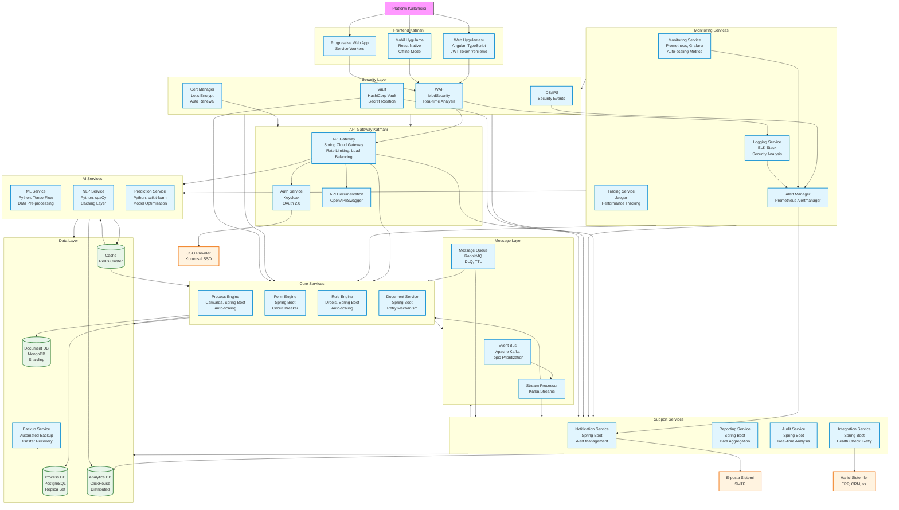

# BPM Platform - Sistem Mimarisi

Bu diyagram, BPM Platform'un sistem mimarisini ve bileşenler arası ilişkileri gösterir.



## Diyagram Açıklaması

### Katmanlar
#### 1. Frontend Katmanı
- **Web Uygulaması**: Angular ve TypeScript ile geliştirilmiş modern web arayüzü
- **Mobil Uygulama**: React Native ile geliştirilmiş iOS ve Android uygulamaları

#### 2. API Gateway Katmanı
- **API Gateway**: Spring Cloud Gateway ile yönlendirme ve yük dengeleme
- **Auth Service**: Keycloak ile kimlik doğrulama ve yetkilendirme
#### 3. Core Services
- **Process Engine**: Camunda tabanlı BPMN süreç yönetimi
- **Form Engine**: Dinamik form yönetimi
- **Rule Engine**: Drools tabanlı iş kuralları motoru
- **Document Service**: Doküman yönetimi
#### 4. Support Services
- **Notification Service**: Bildirim yönetimi
- **Reporting Service**: Raporlama ve analitik
- **Audit Service**: Denetim ve log yönetimi
- **Integration Service**: Harici sistem entegrasyonları
#### 5. AI Services
- **ML Service**: TensorFlow ile makine öğrenmesi
- **NLP Service**: spaCy ile doğal dil işleme
- **Prediction Service**: scikit-learn ile tahminsel analitik
#### 6. Monitoring Services
- **Monitoring Service**: Prometheus ve Grafana ile sistem izleme
- **Logging Service**: ELK Stack ile merkezi log yönetimi
- **Tracing Service**: Jaeger ile distributed tracing
#### 7. Data Layer
- **Process DB**: PostgreSQL ile süreç ve form verileri
- **Document DB**: MongoDB ile doküman verileri
- **Analytics DB**: ClickHouse ile analitik verileri
- **Cache**: Redis ile önbellek verileri
#### 8. Message Layer
- **Event Bus**: Apache Kafka ile event streaming
- **Message Queue**: RabbitMQ ile message queuing
#### 9. Security Layer
- **WAF**: ModSecurity ile web uygulama güvenliği
- **Vault**: HashiCorp Vault ile secrets yönetimi
- **Cert Manager**: Let's Encrypt ile SSL/TLS yönetimi
### Harici Sistemler
- **E-posta Sistemi**: SMTP sunucusu
- **SSO Provider**: 

### Yeni Eklenen Bileşenler ve İyileştirmeler

1. **Yedekleme ve Kurtarma**
   - Backup Service: Otomatik yedekleme ve felaket kurtarma
   - Veritabanı replikasyonu ve sharding
   - Dağıtık veri depolama stratejileri

2. **Servis Dayanıklılığı**
   - Circuit Breaker pattern implementasyonu
   - Retry mekanizmaları
   - Health check servisleri

3. **Performans İyileştirmeleri**
   - Redis cache cluster
   - Veri ön işleme katmanı
   - Auto-scaling yapılandırmaları

4. **Entegrasyon Güvenliği**
   - Health check monitoring
   - Retry politikaları
   - Timeout yapılandırmaları

5. **Ölçeklenebilirlik**
   - Load balancing
   - Horizontal Pod Autoscaling
   - Distributed caching

6. **Güvenlik İzleme**
   - WAF log analizi
   - IDS/IPS entegrasyonu
   - Security event management

7. **Mesajlaşma İyileştirmeleri**
   - Kafka topic önceliklendirme
   - RabbitMQ DLQ
   - Message TTL yapılandırması

8. **API Yönetimi**
   - OpenAPI/Swagger dokümantasyonu
   - Rate limiting
   - API versiyonlama

9. **Hata Yönetimi**
   - Prometheus Alertmanager
   - Log analizi ve alerting
   - Incident response automation

10. **Kullanıcı Deneyimi**
    - JWT token yenileme
    - Offline mode desteği
    - Progressive Web App yapılandırması
``` 