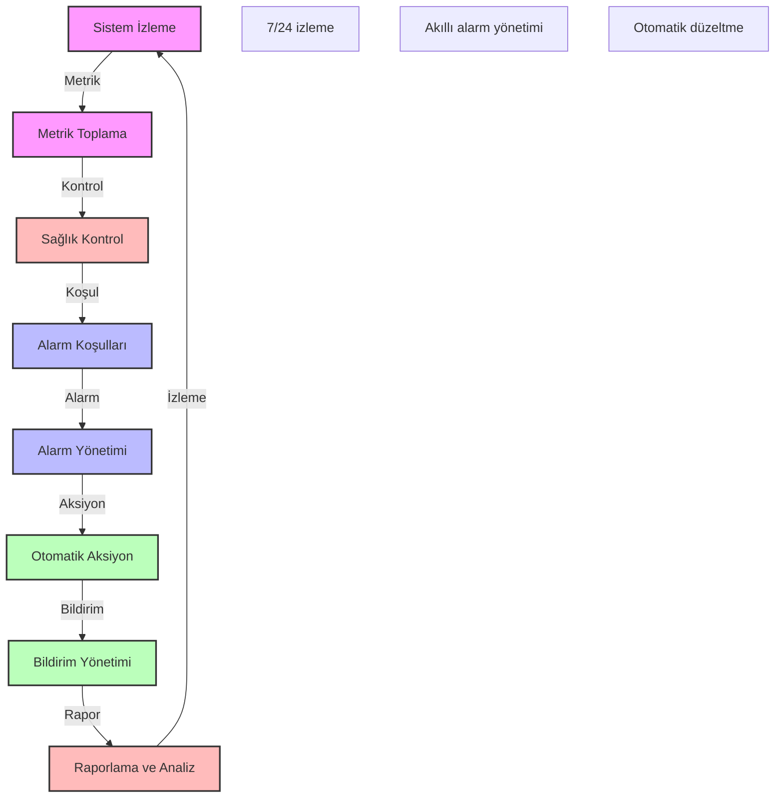

# BPM Platform - Sistem Sağlığı İzleme ve Alarm

Bu diyagram, BPM platformunun sistem sağlığı izleme ve alarm süreçlerini göstermektedir.

## Önemli Noktalar

1. Sistem İzleme
   - Kaynak kullanımı
   - Performans metrikleri
   - Servis durumları
   - Sistem logları

2. Metrik Toplama
   - CPU kullanımı
   - Bellek kullanımı
   - Disk kullanımı
   - Ağ trafiği

3. Sağlık Kontrol
   - Servis sağlığı
   - Veritabanı sağlığı
   - API sağlığı
   - Bağlantı sağlığı

4. Alarm Koşulları
   - Eşik değerleri
   - Alarm kuralları
   - Öncelik seviyeleri
   - Koşul grupları

5. Alarm Yönetimi
   - Alarm tetikleme
   - Alarm filtreleme
   - Alarm birleştirme
   - Alarm doğrulama

6. Otomatik Aksiyon
   - Otomatik düzeltme
   - Kaynak yönetimi
   - Servis yeniden başlatma
   - Yük dengeleme

7. Bildirim Yönetimi
   - Bildirim kanalları
   - Bildirim şablonları
   - Bildirim öncelikleri
   - Bildirim grupları

8. Raporlama ve Analiz
   - Sağlık raporları
   - Performans raporları
   - Trend analizleri
   - İyileştirme önerileri 