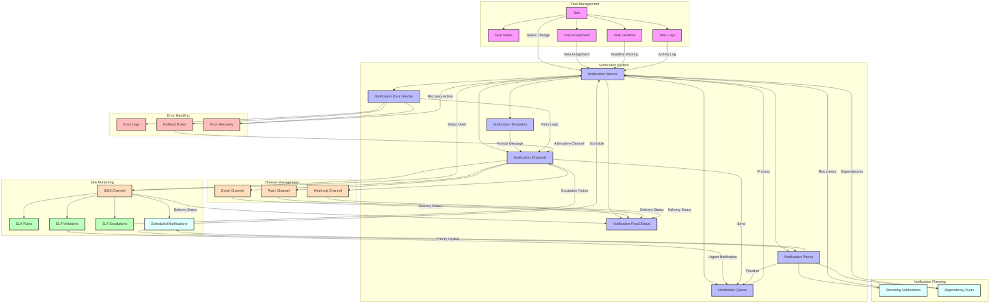

# Task Notification Flow

Bu diyagram, görev yönetimi ve bildirim sistemi arasındaki detaylı entegrasyonu gösterir.



## Detaylı Açıklama

### Ana Bileşenler

1. **Task Management**
   - Task (T): Ana görev nesnesi
   - Task Status (TS): Görev durumu (Oluşturuldu, Devam Ediyor, Tamamlandı)
   - Task Assignment (TA): Görev atama bilgileri
   - Task Deadline (TD): Son tarih bilgisi
   - Task Logs (TL): Görev aktivite logları

2. **Notification System**
   - Notification Service (NS): Ana bildirim servisi
   - Notification Templates (NT): Bildirim şablonları
   - Notification Channels (NC): İletişim kanalları
   - Notification Queue (NQ): Bildirim kuyruğu
   - Notification Priority (NP): Önceliklendirme
   - Notification Read Status (NR): Okunma durumu
   - Notification Error Handler (NE): Hata yönetimi

3. **SLA Monitoring**
   - SLA Monitor (SM): SLA takip sistemi
   - SLA Rules (SR): SLA kuralları
   - SLA Violations (SV): SLA ihlalleri
   - SLA Escalations (SE): Eskalasyon kuralları
   - SLA Priority (SP): SLA öncelikleri

### Özel Bileşenler

1. **Channel Management**
   - Email Channel (EM): E-posta kanalı
   - SMS Channel (SM): SMS kanalı
   - Push Channel (PP): Mobil bildirim kanalı
   - Webhook Channel (WH): Webhook entegrasyonu

2. **Error Handling**
   - Error Logs (EL): Hata kayıtları
   - Fallback Rules (FR): Yedek kanal kuralları
   - Error Recovery (ER): Hata kurtarma

3. **Notification Planning**
   - Scheduled Notifications (SP): Planlanmış bildirimler
   - Recurring Notifications (RP): Tekrarlayan bildirimler
   - Dependency Rules (DP): Bağımlılık kuralları

### Kritik Akışlar

1. **Bildirim Önceliklendirme**
   - Acil bildirimler öncelikli işlenir
   - SLA ihlalleri yüksek öncelikli
   - Normal bildirimler standart kuyrukta

2. **Hata Yönetimi**
   - Başarısız bildirimler loglanır
   - Alternatif kanallar denenir
   - Otomatik kurtarma mekanizmaları

3. **Çok Kanallı Strateji**
   - Birincil kanal başarısız olursa yedek kanal kullanılır
   - Kanal başarı durumu izlenir
   - Teslim durumu takip edilir

4. **Bildirim Planlama**
   - Gelecek bildirimler planlanır
   - Tekrarlayan bildirimler yönetilir
   - Bağımlılıklar kontrol edilir

### Kullanım Örnekleri

1. **Acil Görev Bildirimi**
   ```json
   {
     "notification": {
       "type": "URGENT_TASK",
       "priority": "HIGH",
       "channels": ["email", "sms", "push"],
       "template": "urgent_task_template",
       "fallback": {
         "retry": 3,
         "alternative": ["webhook"]
       }
     }
   }
   ```

2. **SLA İhlal Bildirimi**
   ```json
   {
     "slaViolation": {
       "taskId": "TASK-123",
       "severity": "CRITICAL",
       "escalation": {
         "level": 2,
         "notifyRoles": ["manager", "supervisor"]
       },
       "channels": ["email", "sms"]
     }
   }
   ```

3. **Planlı Bildirim**
   ```json
   {
     "scheduledNotification": {
       "type": "DEADLINE_REMINDER",
       "schedule": {
         "type": "RECURRING",
         "pattern": "1_DAY_BEFORE_DEADLINE",
         "maxReminders": 3
       },
       "channels": ["email"]
     }
   }
   ```
``` 