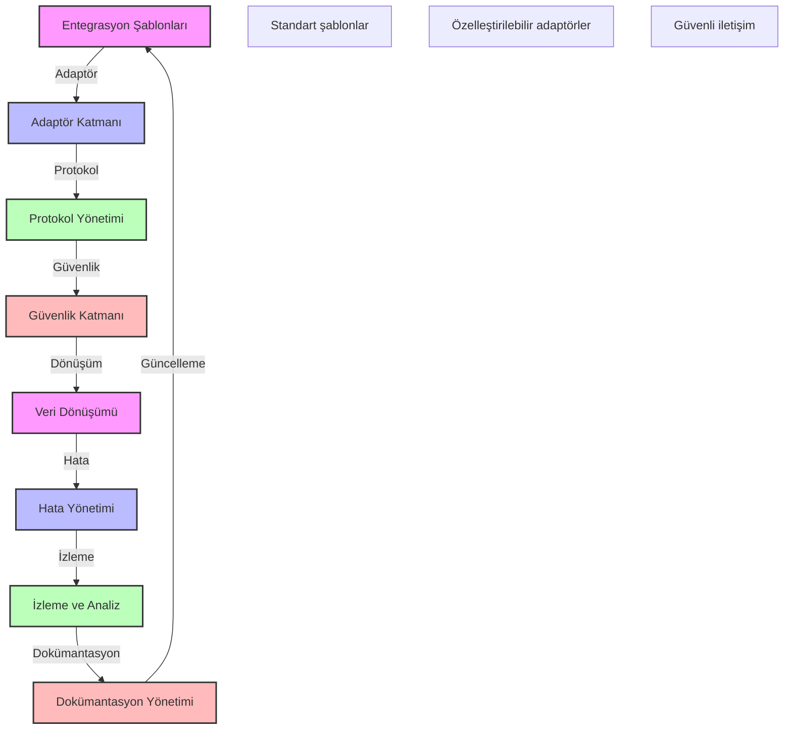

# BPM Platform - Üçüncü Parti Entegrasyon Şablonları

Bu diyagram, BPM platformunun üçüncü parti sistemlerle entegrasyon şablonlarını göstermektedir.

## Önemli Noktalar

1. Entegrasyon Şablonları
   - REST API şablonu
   - SOAP servis şablonu
   - Mesaj kuyruk şablonu
   - Dosya transfer şablonu

2. Adaptör Katmanı
   - Protokol adaptörleri
   - Format adaptörleri
   - Veri adaptörleri
   - Güvenlik adaptörleri

3. Protokol Yönetimi
   - HTTP/HTTPS
   - FTP/SFTP
   - AMQP/MQTT
   - WebSocket

4. Güvenlik Katmanı
   - Kimlik doğrulama
   - Yetkilendirme
   - Şifreleme
   - Güvenlik denetimi

5. Veri Dönüşümü
   - Format dönüşümü
   - Şema dönüşümü
   - Veri haritalama
   - Veri doğrulama

6. Hata Yönetimi
   - Hata yakalama
   - Hata loglama
   - Yeniden deneme
   - Failover yönetimi

7. İzleme ve Analiz
   - Performans izleme
   - Kullanım analizi
   - Hata analizi
   - SLA takibi

8. Dokümantasyon
   - API dokümantasyonu
   - Entegrasyon kılavuzu
   - Örnek kodlar
   - Sorun giderme rehberi