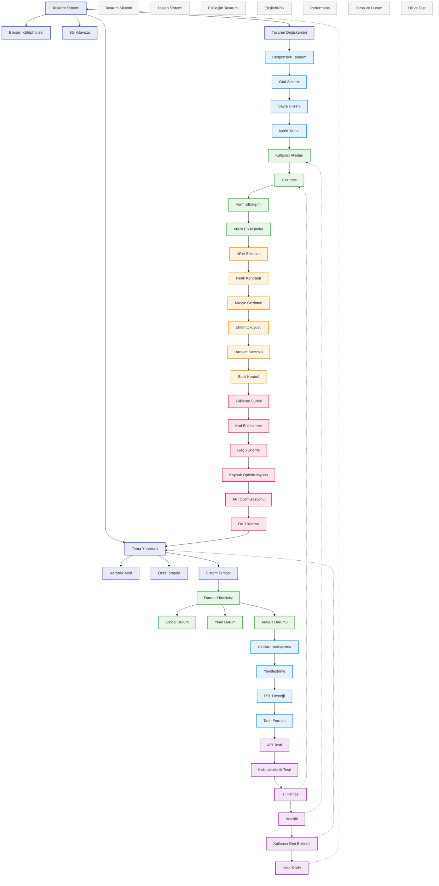

# BPM Platform - Kullanıcı Arayüzü ve Deneyimi Akışı

Bu diyagram, BPM Platform'un kullanıcı arayüzü ve deneyimi süreçlerini gösterir.

## Diyagram Açıklaması

### Tasarım Sistemi
- **Tasarım Sistemi**: Design system
- **Bileşen Kütüphanesi**: Component library (Material UI, Tailwind)
- **Stil Kılavuzu**: Style guide
- **Tasarım Değişkenleri**: Design tokens

### Düzen Sistemi
- **Responsive Tasarım**: Responsive design
- **Grid Sistemi**: Grid system
- **Sayfa Düzeni**: Page layout
- **İçerik Yapısı**: Content structure

### Etkileşim Tasarımı
- **Kullanıcı Akışları**: User flows
- **Gezinme**: Navigation
- **Form Etkileşimi**: Form interaction
- **Mikro Etkileşimler**: Micro-interactions

### Erişilebilirlik
- **ARIA Etiketleri**: ARIA labels
- **Renk Kontrastı**: Color contrast
- **Klavye Gezinme**: Keyboard navigation
- **Ekran Okuyucu**: Screen reader
- **Hareket Kontrolü**: Motion control
- **Sesli Kontrol**: Voice control

### Performans Optimizasyonu
- **Yükleme Süresi**: Load time
- **Kod Bölümleme**: Code splitting
- **Geç Yükleme**: Lazy loading
- **Kaynak Optimizasyonu**: Asset optimization
- **API Optimizasyonu**: API optimization
- **Ön Yükleme**: Prefetching

### Tema Yönetimi
- **Tema Yöneticisi**: Theme manager
- **Karanlık Mod**: Dark mode
- **Özel Temalar**: Custom themes
- **Sistem Teması**: System theme

### Durum Yönetimi
- **Durum Yöneticisi**: State manager
- **Global Durum**: Global state
- **Yerel Durum**: Local state
- **Arayüz Durumu**: UI state

### Dil ve Yerelleştirme
- **Uluslararasılaştırma**: Internationalization (i18n)
- **Yerelleştirme**: Localization (l10n)
- **RTL Desteği**: RTL support
- **Tarih Formatı**: Date format

### Test ve Analiz
- **A/B Testi**: A/B testing
- **Kullanılabilirlik Testi**: Usability testing
- **Isı Haritası**: Heat map
- **Analitik**: Analytics
- **Kullanıcı Geri Bildirimi**: User feedback
- **Hata Takibi**: Error tracking

### Önemli Özellikler
- Tasarım sistemi ve bileşen kütüphanesi
- Responsive ve erişilebilir tasarım
- Performans optimizasyonu
- Tema ve durum yönetimi
- Çoklu dil desteği
- Test ve analiz araçları 