# BPM Platform - Kullanıcı Akış Diyagramı

Bu diyagram, BPM Platform'daki kullanıcı akışlarını ve iş süreçlerini gösterir.

```mermaid
stateDiagram-v2
    state "Giriş ve Kimlik Doğrulama" as auth {
        [*] --> GirisKontrol
        GirisKontrol --> BruteForceKontrol
        BruteForceKontrol --> CaptchaDogrulama
        CaptchaDogrulama --> HesapVarMi
        
        state HesapVarMi <<choice>>
        HesapVarMi --> GirisBilgileri : Evet
        HesapVarMi --> KayitOl : Hayır
        
        GirisBilgileri --> IkiFactorDogrulama
        IkiFactorDogrulama --> GuvenlikKontrolleri
        
        KayitOl --> HesapBilgileri
        HesapBilgileri --> GuvenlikPolitikalari
        GuvenlikPolitikalari --> DogrulamaEmail
    }
    
    state "Yetkilendirme" as authorization {
        [*] --> KimlikDogrulama
        
        state DogrulamaBasarili <<choice>>
        KimlikDogrulama --> DogrulamaBasarili
        
        DogrulamaBasarili --> ProfilYukle : Evet
        DogrulamaBasarili --> HataYonetimi : Hayır
        
        HataYonetimi --> HataMesaji
        HataYonetimi --> GuvenlikLoglama
        
        ProfilYukle --> RolKontrol
        RolKontrol --> YetkiMatrisi
        YetkiMatrisi --> OturumBaslat
        OturumBaslat --> OturumTokenOlustur
        
        HataMesaji --> [*]
    }
    
    state "Kullanıcı Onboarding" as onboarding {
        [*] --> HosgeldinEkrani
        HosgeldinEkrani --> EgitimPlani
        
        state "Eğitim Süreci" as training {
            [*] --> VideoEgitimleri
            [*] --> EtkilesimliRehber
            [*] --> PratikOrnekler
            VideoEgitimleri --> IlerlemeKontrol
            EtkilesimliRehber --> IlerlemeKontrol
            PratikOrnekler --> IlerlemeKontrol
        }
        
        EgitimPlani --> training
        training --> SertifikasyonTesti
        SertifikasyonTesti --> OnboardingTamamlama
    }
    
    state "Süreç Tasarımı" as processDesign {
        [*] --> SureceGiris
        SureceGiris --> BPMNEditor
        
        state YeniSurec <<choice>>
        BPMNEditor --> YeniSurec
        
        YeniSurec --> BosCalismaAlani : Evet
        YeniSurec --> MevcutSurec : Hayır
        
        BosCalismaAlani --> SurecSablonu
        BosCalismaAlani --> OtomatikKayit
        
        state "Yeni Süreç Analizi" as newProcessAnalysis {
            [*] --> BenzerSurecler
            [*] --> SurecDokumantasyon
            BenzerSurecler --> BestPractice
            BenzerSurecler --> OptimizasyonOneriler
            SurecDokumantasyon --> GereksinimAnalizi
            GereksinimAnalizi --> OtomatikDogrulama
        }
        
        state "Mevcut Süreç Analizi" as existingProcessAnalysis {
            [*] --> SurecMetrikleri
            [*] --> DegisiklikGecmisi
            SurecMetrikleri --> PerformansInceleme
            SurecMetrikleri --> TahminselAnaliz
            DegisiklikGecmisi --> EtkiAnalizi
            EtkiAnalizi --> OptimizasyonOneriler
        }
    }
    
    state "Süreç Analizi" as processAnalysis {
        state "KPI Yönetimi" as kpiManagement {
            [*] --> KPITanimlama
            KPITanimlama --> MetrikKonfigurasyon
            MetrikKonfigurasyon --> HedefBelirleme
            HedefBelirleme --> OtomatikTakip
        }
        
        state "Kaynak Yönetimi" as resourceManagement {
            [*] --> KaynakPlanlama
            KaynakPlanlama --> KapasiteAnalizi
            KapasiteAnalizi --> OtomatikOptimizasyon
            OtomatikOptimizasyon --> DynamicScaling
        }
        
        state "SLA Yönetimi" as slaManagement {
            [*] --> SLATanimlama
            SLATanimlama --> RiskDegerlendirme
            RiskDegerlendirme --> ProaktifIzleme
            ProaktifIzleme --> OtomatikMudahale
        }
    }
    
    state "Form ve Kural Tasarımı" as formRuleDesign {
        state "Form İşlemleri" as formOperations {
            [*] --> FormTasarimi
            FormTasarimi --> AlanValidasyon
            AlanValidasyon --> DinamikKurallar
            DinamikKurallar --> OtomatikDogrulama
            OtomatikDogrulama --> HataYonetimi
        }
        
        state "Kural İşlemleri" as ruleOperations {
            [*] --> KuralTanimlama
            KuralTanimlama --> KuralSetiOlustur
            KuralSetiOlustur --> KuralTest
            KuralTest --> OtomatikDogrulama
            OtomatikDogrulama --> VersiyanKontrol
        }
    }
    
    state "Süreç Doğrulama" as processValidation {
        [*] --> TestSenaryolari
        TestSenaryolari --> SurecSimulasyon
        
        state "Test Süreçleri" as testProcesses {
            [*] --> PerformansTest
            [*] --> EntegrasyonTest
            PerformansTest --> YukTesti
            YukTesti --> StressTesti
            EntegrasyonTest --> UctanUcaTest
            UctanUcaTest --> FallbackTesti
        }
        
        state HatalarVarMi <<choice>>
        SurecSimulasyon --> HatalarVarMi
        HatalarVarMi --> HataAnalizi : Evet
        HatalarVarMi --> TestOnayi : Hayır
        
        HataAnalizi --> OtomatikCozumOnerisi
        OtomatikCozumOnerisi --> DuzelticiAksiyonlar
        DuzelticiAksiyonlar --> processDesign
    }
    
    state "Deployment Hazırlığı" as deploymentPrep {
        state "Kaynak Kontrolleri" as resourceChecks {
            [*] --> KaynakKontrol
            KaynakKontrol --> KapasitePlan
            KapasitePlan --> OtomatikOlcekleme
        }
        
        state "Yedeklilik Kontrolleri" as redundancyChecks {
            [*] --> YedeklilikKontrol
            YedeklilikKontrol --> DRTest
            DRTest --> OtomatikFailover
        }
        
        state "Güvenlik Kontrolleri" as securityChecks {
            [*] --> GuvenlikKontrol
            GuvenlikKontrol --> ErisimYonetimi
            ErisimYonetimi --> GuvenlikTaramasi
        }
    }
    
    state "Deployment" as deployment {
        [*] --> DeploymentPlan
        DeploymentPlan --> ChangeRequest
        
        state "Kullanıcı Hazırlığı" as userPrep {
            [*] --> KullaniciBildirim
            KullaniciBildirim --> EgitimPlan
            EgitimPlan --> VideoEgitimler
            VideoEgitimler --> EtkilesimliDemo
        }
        
        state "Rollout Yönetimi" as rolloutManagement {
            [*] --> RolloutStrateji
            RolloutStrateji --> GeriDonusPlan
            GeriDonusPlan --> OtomatikRollback
        }
        
        ChangeRequest --> DeploymentOnay
        DeploymentOnay --> OtomatikDeploy
    }
    
    state "Süreç Kullanımı" as processUsage {
        [*] --> GorevListesi
        
        state GorevVarMi <<choice>>
        GorevListesi --> GorevVarMi
        
        GorevVarMi --> GorevInceleme : Evet
        GorevVarMi --> [*] : Hayır
        
        state "Form İşlemleri" as formTasks {
            [*] --> FormDoldur
            FormDoldur --> OtomatikKayit
            FormDoldur --> DokumanEkle
            DokumanEkle --> VeriDogrulama
            VeriDogrulama --> HataKontrolu
        }
        
        state "Kural İşlemleri" as ruleTasks {
            [*] --> KuralKontrol
            KuralKontrol --> KosulDegerlendirme
            KosulDegerlendirme --> KararUygula
            KararUygula --> OtomatikOnay
        }
        
        state TamamlandiMi <<choice>>
        GorevInceleme --> TamamlandiMi
        TamamlandiMi --> GorevTamamla : Evet
        TamamlandiMi --> TaslakKaydet : Hayır
        
        TaslakKaydet --> OtomatikKayit
        TaslakKaydet --> NotEkle
        GorevTamamla --> GorevListesi
        NotEkle --> GorevListesi
    }
    
    state "İzleme ve Raporlama" as monitoring {
        state "Performans İzleme" as perfMonitoring {
            [*] --> PerformansIzleme
            PerformansIzleme --> KPITakip
            KPITakip --> SLARaporlari
            SLARaporlari --> InteraktifGrafikler
        }
        
        state "Kaynak İzleme" as resourceMonitoring {
            [*] --> KaynakKullanimi
            KaynakKullanimi --> DarbogazAnalizi
            DarbogazAnalizi --> OptimizasyonOneriler
            OptimizasyonOneriler --> OtomatikOptimizasyon
        }
        
        state "Maliyet İzleme" as costMonitoring {
            [*] --> MaliyetAnalizi
            MaliyetAnalizi --> TahminselAnaliz
            TahminselAnaliz --> TrendRaporlari
            TrendRaporlari --> VerimlilikOlcumu
            VerimlilikOlcumu --> OptimizasyonOneriler
        }
    }
    
    state "Destek ve Yardım" as support {
        state "Self Servis" as selfService {
            [*] --> BilgiBankasi
            BilgiBankasi --> DokumanInceleme
            DokumanInceleme --> VideoEgitim
            VideoEgitim --> EtkilesimliRehber
        }
        
        state "Destek Talebi" as supportRequest {
            [*] --> DestekTalebi
            DestekTalebi --> AkilliBotDestek
            AkilliBotDestek --> ChatbotDestek
            ChatbotDestek --> UzmanDestek
            UzmanDestek --> CozumTakibi
        }
        
        state "Topluluk Desteği" as communitySupport {
            [*] --> ToplulukForum
            ToplulukForum --> SoruCevap
            SoruCevap --> BestPractices
            BestPractices --> RozetSistemi
            RozetSistemi --> TopluluktaPaylas
        }
    }
    
    state "Oturum Sonlandırma" as logout {
        [*] --> KaydedilmemisKontrol
        KaydedilmemisKontrol --> OtomatikKayit
        OtomatikKayit --> DegisiklikKaydet
        DegisiklikKaydet --> AktifOturumTemizle
        AktifOturumTemizle --> OturumSonlandir
        OturumSonlandir --> CikisLoglari
        CikisLoglari --> [*]
    }
    
    auth --> authorization
    authorization --> onboarding
    onboarding --> processDesign
    processDesign --> processAnalysis
    processAnalysis --> formRuleDesign
    formRuleDesign --> processValidation
    processValidation --> deploymentPrep
    deploymentPrep --> deployment
    deployment --> processUsage
    processUsage --> monitoring
    monitoring --> support
    support --> logout
```

## Diyagram Açıklaması

Bu diyagram, BPM Platform'daki kullanıcı akışlarını ve iş süreçlerini detaylı bir şekilde göstermektedir. Yapılan güncellemeler şunlardır:

1. **Güvenlik İyileştirmeleri**
   - Brute force koruması
   - Captcha entegrasyonu
   - Güvenlik politikaları
   - Oturum token yönetimi
   - Aktif oturum temizleme

2. **Kullanıcı Onboarding**
   - Etkileşimli rehber
   - Video eğitimleri
   - Pratik örnekler
   - Sertifikasyon süreci

3. **Otomatik Kayıt ve Doğrulama**
   - Form otomatik kayıt
   - Veri doğrulama
   - Hata kontrolü
   - Otomatik onay mekanizmaları

4. **Kaynak Optimizasyonu**
   - Dinamik ölçekleme
   - Otomatik optimizasyon
   - Kapasite planlama
   - Performans izleme

5. **Gelişmiş Test Süreçleri**
   - Fallback testleri
   - Stres testleri
   - Otomatik çözüm önerileri
   - Entegrasyon kontrolleri

6. **İnteraktif Raporlama**
   - Dinamik grafikler
   - Tahminsel analiz
   - Trend raporları
   - Verimlilik ölçümü

7. **Akıllı Görev Yönetimi**
   - Otomatik görev atama
   - Önceliklendirme
   - İş kuralı otomasyonu
   - Durum takibi

8. **Gelişmiş Destek Sistemi**
   - Akıllı bot desteği
   - Etkileşimli rehberler
   - Rozet sistemi
   - Topluluk katılımı

9. **Proaktif İzleme**
   - SLA takibi
   - Otomatik müdahale
   - Risk değerlendirme
   - Darboğaz analizi

10. **Veri Koruma**
    - Otomatik kayıt
    - Versiyon kontrolü
    - Değişiklik takibi
    - Güvenlik loglama 