# BPM Platform - Kullanıcı Davranış Diyagramı

Bu diyagram, BPM Platform'daki kullanıcı rollerini ve kullanım senaryolarını gösterir.

```mermaid
graph LR
    %% Stil Tanımlamaları
    classDef actor fill:#fff,stroke:#000,stroke-width:2px
    classDef usecase fill:#e1f5fe,stroke:#0288d1,stroke-width:2px
    classDef note fill:#fff3e0,stroke:#ef6c00,stroke-width:1px,font-style:italic
    classDef ai fill:#e8f5e9,stroke:#2e7d32,stroke-width:2px
    
    %% Aktörler
    user[Son Kullanıcı]:::actor
    processOwner[Süreç Sahibi]:::actor
    analyst[İş Analisti]:::actor
    admin[Sistem Yöneticisi]:::actor
    support[Destek Ekibi]:::actor

    %% Kimlik Yönetimi
    subgraph auth[Kimlik Yönetimi]
        login[Giriş Yap]:::usecase
        twoFA[2FA Doğrulama]:::usecase
        resetPass[Şifre Sıfırla]:::usecase
        updateProfile[Profil Güncelle]:::usecase
        manageSession[Oturum Yönet]:::usecase
        detectAnomaly[Anomali Tespit]:::ai
        manageCaptcha[CAPTCHA Yönetimi]:::usecase
        
        loginNote[SSO Entegrasyonu<br/>Çoklu Oturum Kontrolü<br/>Güvenlik Logları<br/>OAuth2/OIDC Desteği<br/>Anomali Tespiti<br/>Şüpheli Oturum Engelleme<br/>Akıllı CAPTCHA]:::note
    end

    %% Görev Yönetimi
    subgraph tasks[Görev Yönetimi]
        viewTasks[Görev Listesi]:::usecase
        taskDetail[Görev Detayı]:::usecase
        startTask[Görev Başlat]:::usecase
        completeTask[Görev Tamamla]:::usecase
        delegateTask[Görev Devret]:::usecase
        reminderTask[Görev Hatırlat]:::usecase
        autoAssign[Otomatik Atama]:::ai
        priorityEngine[Önceliklendirme Motoru]:::ai
        
        tasksNote[Önceliklendirme<br/>Filtreleme & Arama<br/>Toplu İşlemler<br/>Takvim Görünümü<br/>SLA Takibi<br/>AI Tabanlı Atama<br/>Otomatik İş Dağılımı]:::note
    end

    %% Form İşlemleri
    subgraph forms[Form İşlemleri]
        fillForm[Form Doldur]:::usecase
        attachDoc[Doküman Ekle]:::usecase
        saveForm[Form Kaydet]:::usecase
        validateForm[Form Doğrula]:::usecase
        saveDraft[Taslak Kaydet]:::usecase
        manageVersion[Versiyon Yönet]:::usecase
        offlineSync[Offline Senkronizasyon]:::usecase
        autoSave[Otomatik Kayıt]:::usecase
        
        formsNote[Dinamik Formlar<br/>Otomatik Hesaplama<br/>Anlık Doğrulama<br/>Doküman Tarama<br/>Offline Çalışma<br/>Otomatik Senkronizasyon<br/>Veri Kaybı Önleme]:::note
    end

    %% Süreç Yönetimi
    subgraph process[Süreç Yönetimi]
        startProcess[Süreç Başlat]:::usecase
        monitorProcess[Süreç İzle]:::usecase
        interventProcess[Süreç Müdahale]:::usecase
        trackSLA[SLA Takip]:::usecase
        processReport[Süreç Raporu]:::usecase
        stopProcess[Süreç Durdur]:::usecase
        notifyChanges[Durum Bildirimi]:::usecase
        predictIssues[Sorun Tahmini]:::ai
        
        processNote[Gerçek Zamanlı İzleme<br/>Darboğaz Analizi<br/>Performans Metrikleri<br/>İş Yükü Analizi<br/>Tahminsel Analitik<br/>Proaktif Bildirimler<br/>AI Destekli Öngörüler]:::note
    end

    %% İş Analizi
    subgraph analysis[İş Analizi]
        designProcess[Süreç Tasarla]:::usecase
        testProcess[Süreç Test]:::usecase
        defineKPI[KPI Tanımla]:::usecase
        optimizeProcess[Süreç Optimize Et]:::usecase
        versionControl[Versiyon Kontrol]:::usecase
        simulateProcess[Süreç Simüle Et]:::usecase
        aiOptimize[AI Optimizasyon]:::ai
        predictKPI[KPI Tahmin]:::ai
        
        analysisNote[BPMN 2.0 Editör<br/>Şablon Yönetimi<br/>İş Kuralları<br/>Dokümantasyon<br/>AI Destekli Öneriler<br/>Tahminsel Analitik<br/>Otomatik Optimizasyon]:::note
    end

    %% Sistem Yönetimi
    subgraph system[Sistem Yönetimi]
        manageUsers[Kullanıcı Yönet]:::usecase
        defineRoles[Rol Tanımla]:::usecase
        managePermissions[İzin Yönet]:::usecase
        monitorSystem[Sistem İzle]:::usecase
        manageBackup[Yedekleme Yönet]:::usecase
        monitorLogs[Log İzle]:::usecase
        auditTrail[Denetim İzleri]:::usecase
        detectThreats[Tehdit Tespiti]:::ai
        
        systemNote[Organizasyon Yapısı<br/>Yetki Matrisi<br/>Denetim İzleri<br/>Entegrasyon Ayarları<br/>Güvenlik Politikaları<br/>ABAC/RBAC<br/>Güvenlik İhlali Tespiti]:::note
    end

    %% Raporlama
    subgraph reporting[Raporlama]
        viewDashboard[Dashboard Görüntüle]:::usecase
        createCustomReport[Özel Rapor Oluştur]:::usecase
        scheduleReport[Rapor Planla]:::usecase
        viewAnalytics[Analitik Görüntüle]:::usecase
        customizeVisuals[Görsel Özelleştir]:::usecase
        aiInsights[AI İçgörüler]:::ai
        
        reportingNote[Gerçek Zamanlı Metrikler<br/>İnteraktif Grafikler<br/>Excel/PDF Export<br/>Rapor Paylaşımı<br/>AI Destekli Analizler<br/>Özelleştirilebilir Dashboard<br/>Dinamik Görselleştirme]:::note
    end

    %% Destek ve Eğitim
    subgraph support[Destek ve Eğitim]
        viewHelp[Yardım Görüntüle]:::usecase
        takeTraining[Eğitim Al]:::usecase
        createTicket[Destek Talebi Oluştur]:::usecase
        searchKB[Bilgi Bankası Ara]:::usecase
        communityForum[Topluluk Forumu]:::usecase
        aiChatbot[AI Chatbot]:::ai
        suggestSolutions[Çözüm Öner]:::ai
        
        supportNote[İnteraktif Yardım<br/>Video Eğitimler<br/>Sertifikasyon<br/>Chatbot Desteği<br/>Uzman Desteği<br/>Akıllı Öneri Sistemi<br/>Otomatik Çözümler]:::note
    end

    %% İlişkiler ve Yeni Bağlantılar
    user --> login
    login --> detectAnomaly
    detectAnomaly --> manageCaptcha
    login --> twoFA
    login --> manageSession
    user --> updateProfile

    user --> viewTasks
    viewTasks --> autoAssign
    autoAssign --> priorityEngine
    viewTasks --> taskDetail
    viewTasks --> reminderTask
    user --> startTask
    user --> completeTask
    user --> delegateTask

    user --> fillForm
    fillForm --> validateForm
    fillForm --> saveDraft
    fillForm --> offlineSync
    fillForm --> autoSave
    user --> attachDoc
    user --> saveForm
    saveForm --> manageVersion

    processOwner --> startProcess
    processOwner --> monitorProcess
    monitorProcess --> predictIssues
    processOwner --> interventProcess
    processOwner --> trackSLA
    processOwner --> processReport
    monitorProcess --> stopProcess
    monitorProcess --> notifyChanges

    analyst --> designProcess
    designProcess --> versionControl
    analyst --> testProcess
    testProcess --> simulateProcess
    analyst --> defineKPI
    defineKPI --> predictKPI
    analyst --> optimizeProcess
    optimizeProcess --> aiOptimize

    admin --> manageUsers
    admin --> defineRoles
    defineRoles --> managePermissions
    admin --> monitorSystem
    admin --> manageBackup
    admin --> monitorLogs
    monitorLogs --> auditTrail
    monitorSystem --> detectThreats

    user --> viewDashboard
    viewDashboard --> customizeVisuals
    processOwner --> createCustomReport
    processOwner --> scheduleReport
    analyst --> viewAnalytics
    viewAnalytics --> aiInsights

    user --> viewHelp
    user --> takeTraining
    user --> createTicket
    user --> searchKB
    searchKB --> aiChatbot
    createTicket --> suggestSolutions
    user --> communityForum

    support --> createTicket
    support --> searchKB
    support --> communityForum
    support --> viewHelp
    support --> takeTraining
```

## Diyagram Açıklaması

Bu diyagram, BPM Platform'daki kullanıcı rollerini ve kullanım senaryolarını göstermektedir. Ana bileşenler şunlardır:

1. **Aktörler**
   - Son Kullanıcı
   - Süreç Sahibi
   - İş Analisti
   - Sistem Yöneticisi
   - Destek Ekibi

2. **Kimlik Yönetimi**
   - SSO entegrasyonu
   - İki faktörlü doğrulama
   - Oturum yönetimi
   - Profil güncelleme

3. **Görev Yönetimi**
   - Görev listesi ve detayları
   - Görev başlatma ve tamamlama
   - Görev devretme ve hatırlatma
   - SLA takibi

4. **Form İşlemleri**
   - Dinamik form doldurma
   - Doküman ekleme
   - Versiyon yönetimi
   - Offline çalışma

5. **Süreç Yönetimi**
   - Süreç izleme ve müdahale
   - SLA takibi
   - Performans metrikleri
   - İş yükü analizi

6. **İş Analizi**
   - BPMN süreç tasarımı
   - Test ve simülasyon
   - KPI tanımlama
   - Süreç optimizasyonu

7. **Sistem Yönetimi**
   - Kullanıcı ve rol yönetimi
   - İzin yönetimi
   - Sistem izleme
   - Yedekleme yönetimi

8. **Raporlama**
   - Dashboard görüntüleme
   - Özel rapor oluşturma
   - Analitik görüntüleme
   - AI destekli analizler

9. **Destek ve Eğitim**
   - İnteraktif yardım
   - Video eğitimler
   - Destek talepleri
   - Topluluk forumu 