# BPM Platform - Kullanıcı Operasyonları Sıralama Diyagramı

Bu diyagram, BPM Platform'daki kullanıcı operasyonlarının sıralı akışını gösterir.

```mermaid
sequenceDiagram
    participant UI as Web Arayüzü
    participant Mobile as Mobil Uygulama
    participant Gateway as API Gateway
    participant Auth as Kimlik Servisi
    participant Task as Görev Servisi
    participant Form as Form Servisi
    participant Process as Süreç Motoru
    participant Doc as Doküman Servisi
    participant Cache as Cache Servisi
    participant AI as AI Motoru
    participant DB as Veritabanı
    participant MQ as Mesaj Kuyruğu
    participant Push as Push Notification

    rect rgb(200, 220, 240)
        Note over UI,MQ: Gelişmiş Kimlik Doğrulama
        UI->>Gateway: POST /auth/login {username, password}
        Gateway->>Auth: validateCredentials()
        Auth->>AI: detectAnomalies(loginAttempt)
        AI-->>Auth: anomalyScore
        alt anomalyScore > threshold
            Auth->>Auth: generateCaptcha()
            Auth-->>UI: 403 {captchaRequired: true}
            UI->>Auth: POST /auth/verify-captcha
        end
        Auth->>DB: SELECT * FROM users WHERE username = ?
        DB-->>Auth: User Data
        Auth->>Auth: validatePassword(hash)
        Auth->>Auth: generateJWT(userData)
        Auth->>Push: registerDeviceToken(userId)
        Auth-->>Gateway: {token, refreshToken, permissions}
        Gateway-->>UI: 200 OK {JWT Token, User Info}
    end

    rect rgb(200, 220, 240)
        Note over UI,MQ: Görev Listesi ve SLA
        UI->>Gateway: GET /tasks?status=active&page=1&size=10
        Gateway->>Cache: checkCache(userId, filters)
        alt Cache Hit
            Cache-->>Gateway: cachedTasks
        else Cache Miss
            Gateway->>Task: fetchUserTasks(userId, filters)
            Task->>DB: SELECT * FROM tasks WHERE assignee = ?
            DB-->>Task: Tasks Array
            Task->>Task: enrichTaskData()
            Task->>AI: analyzeSLAPerformance()
            AI-->>Task: slaMetrics
            Task-->>Gateway: {tasks, pagination, metadata, slaMetrics}
            Gateway->>Cache: updateCache(tasks)
        end
        Gateway-->>UI: 200 OK {Task List JSON}
    end

    rect rgb(200, 220, 240)
        Note over UI,MQ: Offline Form İşlemleri
        UI->>Form: GET /forms/{formId}/template
        Form-->>UI: {formTemplate, validations}
        Note over UI: Store in IndexedDB
        UI->>UI: fillFormOffline()
        UI->>UI: validateLocally()
        UI->>UI: saveToIndexedDB()
        Note over UI: When Online
        UI->>Form: POST /forms/sync {offlineData}
        Form->>Form: validateFormFields()
        Form->>DB: BEGIN TRANSACTION
        Form->>DB: INSERT INTO form_drafts
        Form->>Doc: processAttachments()
        DB-->>Form: Success
        Form-->>UI: 200 OK {syncStatus}
    end

    rect rgb(200, 220, 240)
        Note over UI,MQ: AI Destekli Süreç Analizi
        Process->>DB: SELECT process_metrics
        DB-->>Process: Raw Metrics
        Process->>AI: analyzeProcessPerformance()
        AI->>AI: detectBottlenecks()
        AI->>AI: generateOptimizationSuggestions()
        AI-->>Process: {bottlenecks, suggestions}
        Process->>MQ: PUBLISH process.optimization
        MQ->>Push: notifyProcessOwner
        Push->>Mobile: Push Notification
    end

    rect rgb(200, 220, 240)
        Note over UI,MQ: Gelişmiş Bildirim Yönetimi
        Task->>MQ: PUBLISH task.status.changed
        MQ->>Push: prepareNotification()
        Push->>Push: filterUserPreferences()
        Push->>Mobile: sendPushNotification()
        Push->>UI: WebSocket: status.update
        Mobile->>Mobile: showNotification()
        UI->>UI: updateUI()
    end

    rect rgb(200, 220, 240)
        Note over UI,MQ: Dinamik Cache Yönetimi
        Gateway->>Cache: analyzeUsagePatterns()
        Cache->>Cache: optimizeCachePolicy()
        Cache->>Cache: adjustTTL()
        Cache->>MQ: PUBLISH cache.policy.updated
    end

    rect rgb(200, 220, 240)
        Note over UI,MQ: Kullanıcı Dostu Hata Yönetimi
        UI->>Gateway: POST /tasks/{taskId}/complete
        Gateway->>Task: completeTask()
        alt Error Occurs
            Task-->>Gateway: 500 Internal Error
            Gateway->>AI: analyzeError(error)
            AI-->>Gateway: {friendlyMessage, suggestedActions}
            Gateway-->>UI: {error, suggestions, nextSteps}
            UI->>UI: showUserFriendlyError()
        end
    end

    rect rgb(200, 220, 240)
        Note over UI,MQ: Dinamik Raporlama
        UI->>Gateway: GET /reports/custom
        Gateway->>Task: generateCustomReport(template)
        Task->>AI: analyzeReportingNeeds()
        AI->>AI: generateVisualizationSuggestions()
        Task->>Task: applyCustomTemplate()
        Task-->>Gateway: {report, visualizations}
        Gateway-->>UI: 200 OK {customReport}
    end

    rect rgb(200, 220, 240)
        Note over UI,MQ: Otomatik Ölçeklendirme
        MQ->>MQ: monitorQueueMetrics()
        alt High Load Detected
            MQ->>MQ: triggerAutoScaling()
            MQ->>Gateway: notifyScalingEvent()
        end
    end

    rect rgb(200, 220, 240)
        Note over UI,MQ: Gelişmiş Süreç Versiyonlama
        UI->>Gateway: POST /process/version/upgrade
        Gateway->>Process: upgradeProcessVersion()
        Process->>AI: compareVersions()
        AI-->>Process: {changes, impacts}
        Process->>DB: BEGIN TRANSACTION
        Process->>DB: COPY current_process
        Process->>DB: UPDATE process_version
        Process->>MQ: PUBLISH process.upgraded
        DB-->>Process: COMMIT
        Process-->>UI: {version: "new", changes, visualization}
    end

    rect rgb(200, 220, 240)
        Note over UI,MQ: Detaylı Sistem Sağlığı
        UI->>Gateway: GET /health/dashboard
        Gateway->>Auth: getDetailedHealth()
        Gateway->>Task: getPerformanceMetrics()
        Gateway->>Process: getResourceUtilization()
        Gateway->>Cache: getCacheStatus()
        Gateway->>MQ: getQueueMetrics()
        Gateway->>Gateway: aggregateHealthData()
        Gateway->>AI: analyzeSystemHealth()
        AI-->>Gateway: {insights, recommendations}
        Gateway-->>UI: {health, metrics, insights}
    end

    rect rgb(200, 220, 240)
        Note over UI,MQ: Akıllı Görev Yönetimi
        Process->>Task: checkOverdueTasks()
        Task->>AI: analyzeTaskPatterns()
        AI->>AI: generateReassignmentSuggestions()
        Task->>Task: autoReassignTasks()
        Task->>MQ: PUBLISH task.reassigned
        MQ->>Push: notifyUsers()
        Push->>Mobile: sendPushNotification()
    end

    rect rgb(200, 220, 240)
        Note over UI,MQ: Gelişmiş Oturum Yönetimi
        UI->>Gateway: POST /auth/refresh {refreshToken}
        Gateway->>Auth: validateRefreshToken()
        Auth->>DB: checkActiveDevices(userId)
        DB-->>Auth: activeDevices
        Auth->>Auth: validateDeviceLimit()
        Auth->>Auth: generateNewTokens()
        Auth->>Push: notifyOtherDevices()
        Auth-->>Gateway: {newToken, newRefreshToken}
        Gateway-->>UI: 200 OK {tokens}

        UI->>Gateway: POST /auth/logout {token}
        Gateway->>Auth: invalidateToken()
        Auth->>DB: UPDATE user_sessions
        Auth->>Cache: clearUserCache()
        Auth->>Push: notifyDevices()
        Auth-->>Gateway: 200 OK
        Gateway-->>UI: {message: "Logged out"}
    end

    rect rgb(200, 220, 240)
        Note over UI,MQ: Gelişmiş Dosya İşlemleri
        UI->>Gateway: POST /documents/bulk-upload
        Gateway->>Doc: processBulkUpload(files)
        Doc->>Doc: validateFiles()
        Doc->>Doc: generatePreviews()
        loop her dosya için
            Doc->>DB: INSERT INTO documents
            Doc->>Doc: processDocument()
            Doc->>Cache: cachePreview()
        end
        Doc->>MQ: PUBLISH documents.processed
        Doc-->>Gateway: {uploadedFiles, previews}
        Gateway-->>UI: 200 OK {fileDetails}

        UI->>Gateway: GET /documents/{docId}/preview
        Gateway->>Cache: checkPreviewCache()
        alt Cache Miss
            Gateway->>Doc: generatePreview()
            Doc->>Doc: convertDocument()
            Doc->>Cache: cachePreview()
        end
        Gateway-->>UI: 200 OK {preview}
    end

    rect rgb(200, 220, 240)
        Note over UI,MQ: Süreç Geri Alma ve Versiyon Kontrolü
        UI->>Gateway: POST /process/{processId}/rollback
        Gateway->>Process: initiateRollback()
        Process->>DB: BEGIN TRANSACTION
        Process->>DB: SELECT version_history
        DB-->>Process: versionData
        Process->>AI: analyzeRollbackImpact()
        AI-->>Process: impactAnalysis
        Process->>Process: validateRollbackPossible()
        Process->>DB: RESTORE_POINT create
        Process->>DB: UPDATE process_state
        Process->>MQ: PUBLISH process.rolledback
        DB-->>Process: COMMIT
        Process-->>Gateway: {rollbackStatus, newState}
        Gateway-->>UI: 200 OK {result}

        UI->>Gateway: GET /process/{processId}/history
        Gateway->>Process: getVersionHistory()
        Process->>DB: SELECT changes_log
        DB-->>Process: changeHistory
        Process->>AI: analyzeChanges()
        AI-->>Process: changeAnalysis
        Process-->>Gateway: {history, analysis}
        Gateway-->>UI: 200 OK {versionHistory}
    end
```

## Diyagram Açıklaması

Bu sıralama diyagramı, BPM Platform'daki temel kullanıcı operasyonlarını ve sistem bileşenleri arasındaki etkileşimleri göstermektedir. Diyagram şu ana bölümleri içerir:

1. **Temel Aktörler**
   - Web Arayüzü (UI)
   - Mobil Uygulama
   - API Gateway
   - Kimlik Servisi
   - Görev Servisi
   - Form Servisi
   - Süreç Motoru
   - Doküman Servisi
   - Cache Servisi
   - AI Motoru
   - Veritabanı
   - Mesaj Kuyruğu
   - Push Notification

2. **Ana İşlem Grupları**
   - Gelişmiş Kimlik Doğrulama
   - Görev Yönetimi ve SLA
   - Offline Form İşlemleri
   - AI Destekli Süreç Analizi
   - Gelişmiş Bildirim Yönetimi
   - Dinamik Cache Yönetimi
   - Kullanıcı Dostu Hata Yönetimi
   - Dinamik Raporlama
   - Otomatik Ölçeklendirme
   - Gelişmiş Süreç Versiyonlama
   - Detaylı Sistem Sağlığı
   - Akıllı Görev Yönetimi
   - Gelişmiş Oturum Yönetimi
   - Gelişmiş Dosya İşlemleri
   - Süreç Geri Alma ve Versiyon Kontrolü

3. **Önemli Özellikler**
   - HTTP istekleri için güvenlik kontrolleri
   - Veritabanı işlem yönetimi
   - Mesaj kuyruğu özellikleri
   - Performans izleme
   - Zamanlı işlemler
   - Toplu işlem yönetimi
   - Veri senkronizasyonu
   - Süreç versiyonlama
   - Çoklu cihaz oturum yönetimi
   - Toplu dosya işlemleri
   - Süreç geri alma mekanizmaları
   - Versiyon geçmişi takibi 