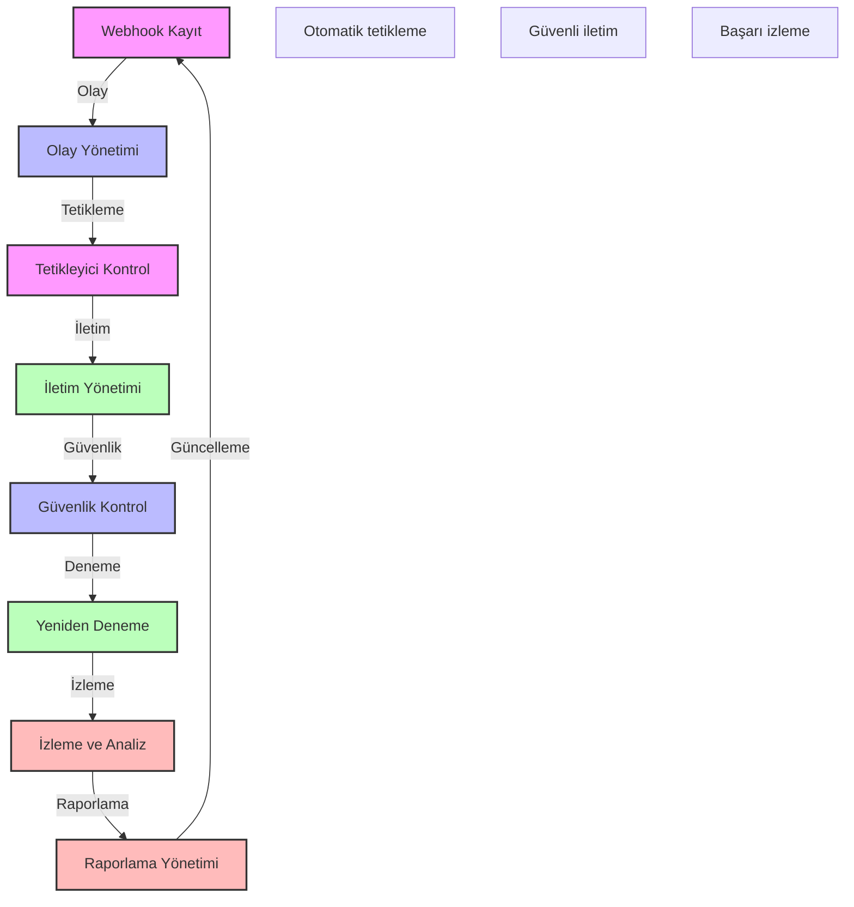

# BPM Platform - Webhook Yönetimi

Bu diyagram, BPM platformunun webhook yönetim süreçlerini göstermektedir.

## Önemli Noktalar

1. Webhook Kayıt
   - Endpoint tanımı
   - Olay aboneliği
   - Kimlik bilgileri
   - Durum yönetimi

2. Olay Yönetimi
   - Olay tipleri
   - Olay filtreleme
   - Olay önceliklendirme
   - Olay zenginleştirme

3. İletim Yönetimi
   - HTTP/HTTPS iletimi
   - Yük dengeleme
   - Zaman aşımı yönetimi
   - Sıralı iletim

4. Güvenlik Kontrol
   - Kimlik doğrulama
   - İmza doğrulama
   - Rate limiting
   - IP filtreleme

5. Yeniden Deneme
   - Deneme stratejisi
   - Deneme aralıkları
   - Maksimum deneme
   - Hata yönetimi

6. İzleme ve Analiz
   - Başarı oranları
   - Yanıt süreleri
   - Hata tipleri
   - Kullanım analizi

7. Raporlama
   - Başarı raporları
   - Hata raporları
   - Performans raporları
   - Trend analizi